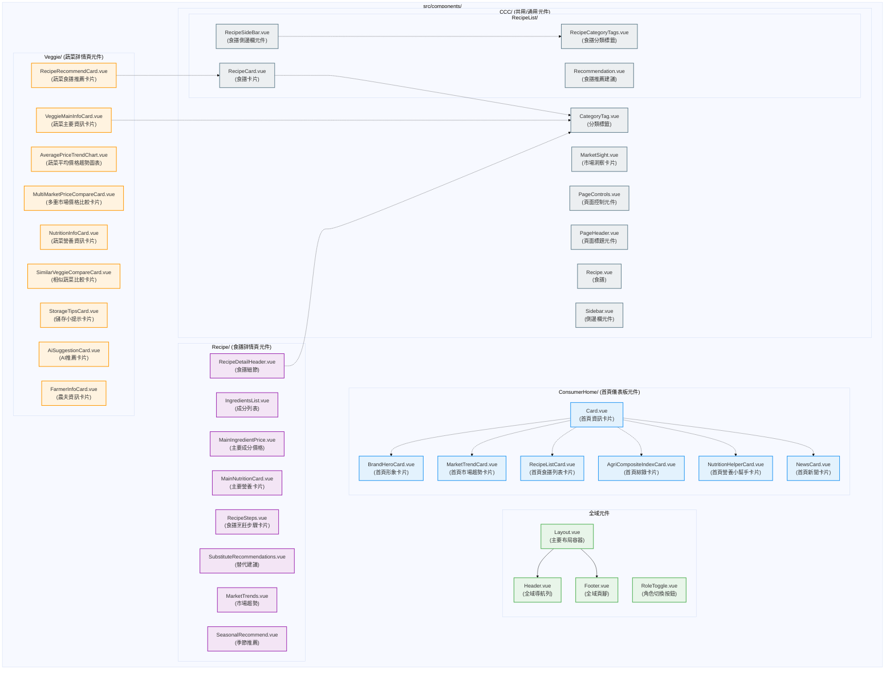
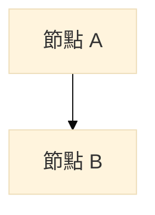
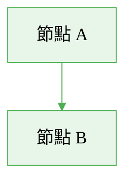
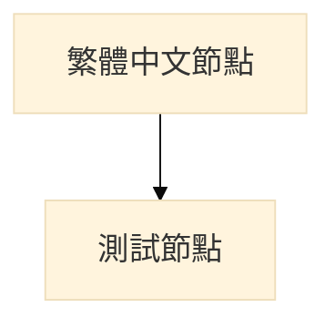
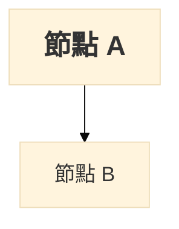
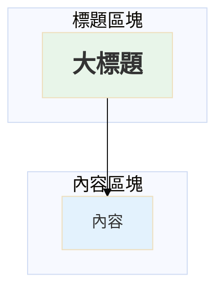

# 7-3 元件說明

## 一、元件架構概覽

食價登錄系統 (FreshLog) 前端元件採用模組化設計，依照功能與頁面分層組織。元件分為四大類：**全域共用元件**、**首頁儀表板元件**、**蔬菜詳情頁元件**、**食譜詳情頁元件**，以及**共用/通用元件 (CCC)**。

---

## 二、UML 元件圖

### 2.1 完整元件架構圖（使用 PlantUML 語法）

```plantuml
@startuml FreshLog元件架構圖

!define COMPONENT_GLOBAL #E8F5E9
!define COMPONENT_HOME #E3F2FD
!define COMPONENT_VEGGIE #FFF3E0
!define COMPONENT_RECIPE #F3E5F5
!define COMPONENT_COMMON #ECEFF1

title 食價登錄系統 (FreshLog) - 前端元件架構圖

package "src/components/" {

  ' ========== 全域導航列 ==========
  package "全域導航列" as GlobalNav COMPONENT_GLOBAL {
    component "Header.vue" as Header #E8F5E9 [
      <b>Header.vue</b>
      ----
      全域導航列
      ----
      • 響應式導航
      • 智慧搜尋功能
      • 會員狀態管理
      • 角色判斷顯示
    ]
  }

  ' ========== 全域頁腳 ==========
  package "全域頁腳" as GlobalFooter COMPONENT_GLOBAL {
    component "Footer.vue" as Footer #E8F5E9 [
      <b>Footer.vue</b>
      ----
      全域頁腳
      ----
      • 網站資訊
      • 連結導航
      • 版權聲明
    ]
  }

  ' ========== 主要布局容器 ==========
  package "主要布局容器" as GlobalLayout COMPONENT_GLOBAL {
    component "Layout.vue" as Layout #E8F5E9 [
      <b>Layout.vue</b>
      ----
      主要布局容器
      ----
      • Header + Router View + Footer
      • 統一頁面結構
    ]
  }

  ' ========== 角色切換按鈕 ==========
  package "角色切換按鈕" as RoleTogglePackage COMPONENT_GLOBAL {
    component "RoleToggle.vue" as RoleToggle #E8F5E9 [
      <b>RoleToggle.vue</b>
      ----
      角色切換按鈕
      ----
      • 消費者/農民角色切換
      • 路由導航
    ]
  }

  ' ========== 首頁儀表板元件 ==========
  package "ConsumerHome/" as ConsumerHomePackage COMPONENT_HOME {
    note right of ConsumerHomePackage
      <b>首頁儀表板元件</b>
      消費者首頁的各種資訊卡片
    end note

    component "Card.vue" as Card #E3F2FD [
      <b>Card.vue</b>
      ----
      首頁資訊卡片
      ----
      • 基礎卡片容器
      • 統一樣式
    ]

    component "BrandHeroCard.vue" as BrandHeroCard #E3F2FD [
      <b>BrandHeroCard.vue</b>
      ----
      首頁形象卡片
      ----
      • 品牌視覺展示
      • Hero Section
    ]

    component "MarketTrendCard.vue" as MarketTrendCard #E3F2FD [
      <b>MarketTrendCard.vue</b>
      ----
      首頁市場趨勢卡片
      ----
      • D3.js 長條圖
      • 市場價格趨勢
    ]

    component "RecipeListCard.vue" as RecipeListCard #E3F2FD [
      <b>RecipeListCard.vue</b>
      ----
      首頁食譜列表卡片
      ----
      • 推薦食譜列表
      • 快速導航
    ]

    component "AgriCompositeIndexCard.vue" as AgriCompositeIndexCard #E3F2FD [
      <b>AgriCompositeIndexCard.vue</b>
      ----
      首頁綜錄卡片
      ----
      • 農產品綜合指數
      • 價格綜合指標
    ]

    component "NutritionHelperCard.vue" as NutritionHelperCard #E3F2FD [
      <b>NutritionHelperCard.vue</b>
      ----
      首頁營養小幫手卡片
      ----
      • 營養資訊提示
      • 健康建議
    ]

    component "NewsCard.vue" as NewsCard #E3F2FD [
      <b>NewsCard.vue</b>
      ----
      首頁新聞卡片
      ----
      • 最新消息
      • 農業新聞
    ]
  }

  ' ========== 蔬菜詳情頁元件 ==========
  package "Veggie/" as VeggiePackage COMPONENT_VEGGIE {
    note right of VeggiePackage
      <b>蔬菜詳情頁元件</b>
      蔬菜內頁的各種資訊卡片
    end note

    component "VeggieMainInfoCard.vue" as VeggieMainInfoCard #FFF3E0 [
      <b>VeggieMainInfoCard.vue</b>
      ----
      蔬菜主要資訊卡片
      ----
      • 蔬菜基本資訊
      • 收藏功能
      • 價格警示
    ]

    component "AveragePriceTrendChart.vue" as AveragePriceTrendChart #FFF3E0 [
      <b>AveragePriceTrendChart.vue</b>
      ----
      蔬菜平均價格趨勢圖表
      ----
      • Chart.js 折線圖
      • 30/90 天趨勢
    ]

    component "MultiMarketPriceCompareCard.vue" as MultiMarketPriceCompareCard #FFF3E0 [
      <b>MultiMarketPriceCompareCard.vue</b>
      ----
      多重市場價格比較卡片
      ----
      • 各市場價格對比
      • 最低價標示
    ]

    component "NutritionInfoCard.vue" as NutritionInfoCard #FFF3E0 [
      <b>NutritionInfoCard.vue</b>
      ----
      蔬菜營養資訊卡片
      ----
      • 營養成分表
      • 健康功效
    ]

    component "SimilarVeggieCompareCard.vue" as SimilarVeggieCompareCard #FFF3E0 [
      <b>SimilarVeggieCompareCard.vue</b>
      ----
      相似蔬菜比較卡片
      ----
      • 替代品推薦
      • 價格比較
    ]

    component "RecipeRecommendCard.vue" as RecipeRecommendCard #FFF3E0 [
      <b>RecipeRecommendCard.vue</b>
      ----
      蔬菜食譜推薦卡片
      ----
      • 相關食譜推薦
      • 快速導航
    ]

    component "StorageTipsCard.vue" as StorageTipsCard #FFF3E0 [
      <b>StorageTipsCard.vue</b>
      ----
      儲存小提示卡片
      ----
      • 保存方法
      • 保鮮技巧
    ]

    component "AiSuggestionCard.vue" as AiSuggestionCard #FFF3E0 [
      <b>AiSuggestionCard.vue</b>
      ----
      AI推薦卡片
      ----
      • AI 智慧推薦
      • 個人化建議
    ]

    component "FarmerInfoCard.vue" as FarmerInfoCard #FFF3E0 [
      <b>FarmerInfoCard.vue</b>
      ----
      農夫資訊卡片
      ----
      • 生產者資訊
      • 產地介紹
    ]
  }

  ' ========== 食譜詳情頁元件 ==========
  package "Recipe/" as RecipePackage COMPONENT_RECIPE {
    note right of RecipePackage
      <b>食譜詳情頁元件</b>
      食譜內頁的各種資訊元件
    end note

    component "RecipeDetailHeader.vue" as RecipeDetailHeader #F3E5F5 [
      <b>RecipeDetailHeader.vue</b>
      ----
      食譜細節
      ----
      • 食譜標題與圖片
      • 收藏功能
      • 基本資訊
    ]

    component "IngredientsList.vue" as IngredientsList #F3E5F5 [
      <b>IngredientsList.vue</b>
      ----
      成分列表
      ----
      • 食材清單
      • 份量標示
    ]

    component "MainIngredientPrice.vue" as MainIngredientPrice #F3E5F5 [
      <b>MainIngredientPrice.vue</b>
      ----
      主要成分價格
      ----
      • 主要食材價格
      • 成本估算
    ]

    component "MainNutritionCard.vue" as MainNutritionCard #F3E5F5 [
      <b>MainNutritionCard.vue</b>
      ----
      主要營養卡片
      ----
      • 營養成分表
      • 卡路里資訊
    ]

    component "RecipeSteps.vue" as RecipeSteps #F3E5F5 [
      <b>RecipeSteps.vue</b>
      ----
      食譜烹飪步驟卡片
      ----
      • 步驟說明
      • 圖文教學
    ]

    component "SubstituteRecommendations.vue" as SubstituteRecommendations #F3E5F5 [
      <b>SubstituteRecommendations.vue</b>
      ----
      替代建議
      ----
      • 食材替代方案
      • 價格優化建議
    ]

    component "MarketTrends.vue" as MarketTrends #F3E5F5 [
      <b>MarketTrends.vue</b>
      ----
      市場趨勢
      ----
      • 食材價格趨勢
      • 市場分析
    ]

    component "SeasonalRecommend.vue" as SeasonalRecommend #F3E5F5 [
      <b>SeasonalRecommend.vue</b>
      ----
      季節推薦
      ----
      • 當季食材推薦
      • 季節性建議
    ]
  }

  ' ========== 共用/通用元件 (CCC) ==========
  package "CCC/" as CCCPackage COMPONENT_COMMON {
    note right of CCCPackage
      <b>共用/通用元件</b>
      跨頁面共用的元件
    end note

    component "CategoryTag.vue" as CategoryTag #ECEFF1 [
      <b>CategoryTag.vue</b>
      ----
      分類標籤
      ----
      • 分類標示
      • 顏色標籤
    ]

    component "MarketSight.vue" as MarketSight #ECEFF1 [
      <b>MarketSight.vue</b>
      ----
      市場洞察卡片
      ----
      • 市場分析
      • 趨勢洞察
    ]

    component "PageControls.vue" as PageControls #ECEFF1 [
      <b>PageControls.vue</b>
      ----
      頁面控制元件
      ----
      • 分頁控制
      • 導航按鈕
    ]

    component "PageHeader.vue" as PageHeader #ECEFF1 [
      <b>PageHeader.vue</b>
      ----
      頁面標題元件
      ----
      • 頁面標題
      • 麵包屑導航
    ]

    component "Recipe.vue" as Recipe #ECEFF1 [
      <b>Recipe.vue</b>
      ----
      食譜
      ----
      • 食譜基礎元件
      • 食譜卡片容器
    ]

    component "Sidebar.vue" as Sidebar #ECEFF1 [
      <b>Sidebar.vue</b>
      ----
      側邊欄元件
      ----
      • 側邊導航
      • 篩選功能
    ]

    package "RecipeList/" as RecipeListPackage {
      component "RecipeCard.vue" as RecipeCard #ECEFF1 [
        <b>RecipeCard.vue</b>
        ----
        食譜卡片
        ----
        • 食譜卡片展示
        • 收藏功能
      ]

      component "RecipeCategoryTags.vue" as RecipeCategoryTags #ECEFF1 [
        <b>RecipeCategoryTags.vue</b>
        ----
        食譜分類標籤
        ----
        • 分類篩選
        • 標籤導航
      ]

      component "RecipeSideBar.vue" as RecipeSideBar #ECEFF1 [
        <b>RecipeSideBar.vue</b>
        ----
        食譜側邊欄元件
        ----
        • 食譜篩選
        • 分類導航
      ]

      component "Recommendation.vue" as Recommendation #ECEFF1 [
        <b>Recommendation.vue</b>
        ----
        食譜推薦建議
        ----
        • 智慧推薦
        • 個人化建議
      ]
    }
  }
}

' ========== 依賴關係 ==========

' Layout 依賴
Layout --> Header : 包含
Layout --> Footer : 包含

' ConsumerHome 元件間依賴
Card <.. BrandHeroCard : 繼承
Card <.. MarketTrendCard : 繼承
Card <.. RecipeListCard : 繼承
Card <.. AgriCompositeIndexCard : 繼承
Card <.. NutritionHelperCard : 繼承
Card <.. NewsCard : 繼承

' Veggie 元件使用共用元件
VeggieMainInfoCard ..> CategoryTag : 使用
RecipeRecommendCard ..> RecipeCard : 使用

' Recipe 元件使用共用元件
RecipeDetailHeader ..> CategoryTag : 使用
IngredientsList ..> MarketTrends : 使用

' RecipeList 元件使用共用元件
RecipeCard ..> CategoryTag : 使用
RecipeSideBar ..> RecipeCategoryTags : 使用

legend right
  |= 符號 |= 說明 |
  | --> | 包含關係 |
  | <.. | 繼承/擴展 |
  | ..> | 使用關係 |
endlegend

@enduml
```

---

### 2.2 簡化版元件分層圖（使用 Mermaid 語法）



---

### 2.3 元件樹狀結構圖（使用 Mermaid Tree Diagram）

```mermaid
%%{init: {'theme':'base', 'themeVariables': { 'fontSize':'18px', 'fontFamily':'Arial'}}}%%
graph TB
    Root["src/components/"]

    Root --> Header["Header.vue<br/>(全域導航列)"]
    Root --> Footer["Footer.vue<br/>(全域頁腳)"]
    Root --> Layout["Layout.vue<br/>(主要布局容器)"]
    Root --> RoleToggle["RoleToggle.vue<br/>(角色切換按鈕)"]

    Root --> ConsumerHome["ConsumerHome/"]
    ConsumerHome --> Card["Card.vue"]
    ConsumerHome --> BrandHeroCard["BrandHeroCard.vue"]
    ConsumerHome --> MarketTrendCard["MarketTrendCard.vue"]
    ConsumerHome --> RecipeListCard["RecipeListCard.vue"]
    ConsumerHome --> AgriCompositeIndexCard["AgriCompositeIndexCard.vue"]
    ConsumerHome --> NutritionHelperCard["NutritionHelperCard.vue"]
    ConsumerHome --> NewsCard["NewsCard.vue"]

    Root --> Veggie["Veggie/"]
    Veggie --> VeggieMainInfoCard["VeggieMainInfoCard.vue"]
    Veggie --> AveragePriceTrendChart["AveragePriceTrendChart.vue"]
    Veggie --> MultiMarketPriceCompareCard["MultiMarketPriceCompareCard.vue"]
    Veggie --> NutritionInfoCard["NutritionInfoCard.vue"]
    Veggie --> SimilarVeggieCompareCard["SimilarVeggieCompareCard.vue"]
    Veggie --> RecipeRecommendCard["RecipeRecommendCard.vue"]
    Veggie --> StorageTipsCard["StorageTipsCard.vue"]
    Veggie --> AiSuggestionCard["AiSuggestionCard.vue"]
    Veggie --> FarmerInfoCard["FarmerInfoCard.vue"]

    Root --> Recipe["Recipe/"]
    Recipe --> RecipeDetailHeader["RecipeDetailHeader.vue"]
    Recipe --> IngredientsList["IngredientsList.vue"]
    Recipe --> MainIngredientPrice["MainIngredientPrice.vue"]
    Recipe --> MainNutritionCard["MainNutritionCard.vue"]
    Recipe --> RecipeSteps["RecipeSteps.vue"]
    Recipe --> SubstituteRecommendations["SubstituteRecommendations.vue"]
    Recipe --> MarketTrends["MarketTrends.vue"]
    Recipe --> SeasonalRecommend["SeasonalRecommend.vue"]

    Root --> CCC["CCC/"]
    CCC --> CategoryTag["CategoryTag.vue"]
    CCC --> MarketSight["MarketSight.vue"]
    CCC --> PageControls["PageControls.vue"]
    CCC --> PageHeaderCCC["PageHeader.vue"]
    CCC --> RecipeCCC["Recipe.vue"]
    CCC --> SidebarCCC["Sidebar.vue"]

    CCC --> RecipeList["RecipeList/"]
    RecipeList --> RecipeCard["RecipeCard.vue"]
    RecipeList --> RecipeCategoryTags["RecipeCategoryTags.vue"]
    RecipeList --> RecipeSideBar["RecipeSideBar.vue"]
    RecipeList --> Recommendation["Recommendation.vue"]

    classDef globalStyle fill:#E8F5E9,stroke:#4CAF50,stroke-width:2px
    classDef homeStyle fill:#E3F2FD,stroke:#2196F3,stroke-width:2px
    classDef veggieStyle fill:#FFF3E0,stroke:#FF9800,stroke-width:2px
    classDef recipeStyle fill:#F3E5F5,stroke:#9C27B0,stroke-width:2px
    classDef commonStyle fill:#ECEFF1,stroke:#607D8B,stroke-width:2px
    classDef dirStyle fill:#FAFAFA,stroke:#9E9E9E,stroke-width:2px,stroke-dasharray: 5 5

    class Header,Footer,Layout,RoleToggle globalStyle
    class Card,BrandHeroCard,MarketTrendCard,RecipeListCard,AgriCompositeIndexCard,NutritionHelperCard,NewsCard homeStyle
    class VeggieMainInfoCard,AveragePriceTrendChart,MultiMarketPriceCompareCard,NutritionInfoCard,SimilarVeggieCompareCard,RecipeRecommendCard,StorageTipsCard,AiSuggestionCard,FarmerInfoCard veggieStyle
    class RecipeDetailHeader,IngredientsList,MainIngredientPrice,MainNutritionCard,RecipeSteps,SubstituteRecommendations,MarketTrends,SeasonalRecommend recipeStyle
    class CategoryTag,MarketSight,PageControls,PageHeaderCCC,RecipeCCC,SidebarCCC,RecipeCard,RecipeCategoryTags,RecipeSideBar,Recommendation commonStyle
    class Root,ConsumerHome,Veggie,Recipe,CCC,RecipeList dirStyle
```



---

## 三、元件分類說明

### 3.1 全域元件 (Global Components)

全域元件在整個應用程式中共用，提供統一的導航、布局與頁腳功能。

| 元件名稱 | 檔案路徑 | 說明 | 主要功能 |
|---------|---------|------|---------|
| Header.vue | `src/components/Header.vue` | 全域導航列 | • 響應式導航<br>• 智慧搜尋功能<br>• 會員狀態管理<br>• 角色判斷顯示 |
| Footer.vue | `src/components/Footer.vue` | 全域頁腳 | • 網站資訊<br>• 連結導航<br>• 版權聲明 |
| Layout.vue | `src/components/Layout.vue` | 主要布局容器 | • Header + Router View + Footer<br>• 統一頁面結構 |
| RoleToggle.vue | `src/components/RoleToggle.vue` | 角色切換按鈕 | • 消費者/農民角色切換<br>• 路由導航 |

---

### 3.2 首頁儀表板元件 (ConsumerHome/)

首頁儀表板元件提供消費者首頁的各種資訊卡片，採用 Bento Box 布局設計。

| 元件名稱 | 檔案路徑 | 說明 | 主要功能 |
|---------|---------|------|---------|
| Card.vue | `ConsumerHome/Card.vue` | 首頁資訊卡片 | • 基礎卡片容器<br>• 統一樣式<br>• 被其他卡片繼承 |
| BrandHeroCard.vue | `ConsumerHome/BrandHeroCard.vue` | 首頁形象卡片 | • 品牌視覺展示<br>• Hero Section<br>• 占據 2x2 格 |
| MarketTrendCard.vue | `ConsumerHome/MarketTrendCard.vue` | 首頁市場趨勢卡片 | • D3.js 長條圖<br>• 市場價格趨勢<br>• 互動式圖表 |
| RecipeListCard.vue | `ConsumerHome/RecipeListCard.vue` | 首頁食譜列表卡片 | • 推薦食譜列表<br>• 快速導航<br>• 水平捲動 |
| AgriCompositeIndexCard.vue | `ConsumerHome/AgriCompositeIndexCard.vue` | 首頁綜錄卡片 | • 農產品綜合指數<br>• 價格綜合指標<br>• 數據視覺化 |
| NutritionHelperCard.vue | `ConsumerHome/NutritionHelperCard.vue` | 首頁營養小幫手卡片 | • 營養資訊提示<br>• 健康建議<br>• 小知識分享 |
| NewsCard.vue | `ConsumerHome/NewsCard.vue` | 首頁新聞卡片 | • 最新消息<br>• 農業新聞<br>• 更新通知 |

**Grid 布局配置**：
```css
/* 16 欄 Grid 系統 */
.brand-hero-card    { grid-column: span 8; grid-row: span 2; }  /* 2x2 大卡 */
.market-trend-card  { grid-column: span 8; grid-row: span 1; }  /* 1x2 寬卡 */
.recipe-list-card   { grid-column: span 8; grid-row: span 1; }  /* 1x2 寬卡 */
.agri-index-card    { grid-column: span 4; grid-row: span 1; }  /* 1x1 小卡 */
.nutrition-card     { grid-column: span 4; grid-row: span 1; }  /* 1x1 小卡 */
.news-card          { grid-column: span 4; grid-row: span 1; }  /* 1x1 小卡 */
```

---

### 3.3 蔬菜詳情頁元件 (Veggie/)

蔬菜詳情頁元件提供蔬菜內頁的各種資訊卡片，包含價格、營養、推薦等功能。

| 元件名稱 | 檔案路徑 | 說明 | 主要功能 |
|---------|---------|------|---------|
| VeggieMainInfoCard.vue | `Veggie/VeggieMainInfoCard.vue` | 蔬菜主要資訊卡片 | • 蔬菜基本資訊（名稱、圖片、英文名）<br>• 收藏功能（JWT 認證）<br>• 價格警示（±20% 提醒）<br>• 當季推薦徽章 |
| AveragePriceTrendChart.vue | `Veggie/AveragePriceTrendChart.vue` | 蔬菜平均價格趨勢圖表 | • Chart.js 折線圖<br>• 30/90 天趨勢切換<br>• 響應式圖表<br>• Tooltip 互動 |
| MultiMarketPriceCompareCard.vue | `Veggie/MultiMarketPriceCompareCard.vue` | 多重市場價格比較卡片 | • 各市場價格對比<br>• 最低價標示<br>• 表格呈現 |
| NutritionInfoCard.vue | `Veggie/NutritionInfoCard.vue` | 蔬菜營養資訊卡片 | • 營養成分表<br>• 健康功效<br>• 營養價值說明 |
| SimilarVeggieCompareCard.vue | `Veggie/SimilarVeggieCompareCard.vue` | 相似蔬菜比較卡片 | • 替代品推薦<br>• 價格比較<br>• 快速導航 |
| RecipeRecommendCard.vue | `Veggie/RecipeRecommendCard.vue` | 蔬菜食譜推薦卡片 | • 相關食譜推薦<br>• 使用 RecipeCard 元件<br>• 水平捲動列表 |
| StorageTipsCard.vue | `Veggie/StorageTipsCard.vue` | 儲存小提示卡片 | • 保存方法<br>• 保鮮技巧<br>• 小圖示提示 |
| AiSuggestionCard.vue | `Veggie/AiSuggestionCard.vue` | AI推薦卡片 | • AI 智慧推薦<br>• 個人化建議<br>• 替代品推薦 |
| FarmerInfoCard.vue | `Veggie/FarmerInfoCard.vue` | 農夫資訊卡片 | • 生產者資訊<br>• 產地介紹<br>• 聯絡資訊 |

**頁面布局順序**：
```
VeggieDetailPage.vue
  ├─ VeggieMainInfoCard.vue (最上方，主要資訊)
  ├─ AveragePriceTrendChart.vue (價格趨勢圖)
  ├─ MultiMarketPriceCompareCard.vue (市場比價)
  ├─ NutritionInfoCard.vue (營養資訊)
  ├─ SimilarVeggieCompareCard.vue (相似蔬菜)
  ├─ RecipeRecommendCard.vue (食譜推薦)
  ├─ StorageTipsCard.vue (儲存技巧)
  ├─ AiSuggestionCard.vue (AI 推薦)
  └─ FarmerInfoCard.vue (農夫資訊)
```

---

### 3.4 食譜詳情頁元件 (Recipe/)

食譜詳情頁元件提供食譜內頁的各種資訊元件，包含食材、步驟、營養等功能。

| 元件名稱 | 檔案路徑 | 說明 | 主要功能 |
|---------|---------|------|---------|
| RecipeDetailHeader.vue | `Recipe/RecipeDetailHeader.vue` | 食譜細節 | • 食譜標題與圖片<br>• 收藏功能（JWT 認證）<br>• 基本資訊（烹飪時間、難度、份量）<br>• 分類標籤 |
| IngredientsList.vue | `Recipe/IngredientsList.vue` | 成分列表 | • 食材清單<br>• 份量標示<br>• 分類顯示（主食材/配料/調味料） |
| MainIngredientPrice.vue | `Recipe/MainIngredientPrice.vue` | 主要成分價格 | • 主要食材價格<br>• 成本估算<br>• 價格趨勢 |
| MainNutritionCard.vue | `Recipe/MainNutritionCard.vue` | 主要營養卡片 | • 營養成分表<br>• 卡路里資訊<br>• 每份營養價值 |
| RecipeSteps.vue | `Recipe/RecipeSteps.vue` | 食譜烹飪步驟卡片 | • 步驟說明<br>• 圖文教學<br>• 計時器功能 |
| SubstituteRecommendations.vue | `Recipe/SubstituteRecommendations.vue` | 替代建議 | • 食材替代方案<br>• 價格優化建議<br>• 季節性替代 |
| MarketTrends.vue | `Recipe/MarketTrends.vue` | 市場趨勢 | • 食材價格趨勢<br>• 市場分析<br>• 購買建議 |
| SeasonalRecommend.vue | `Recipe/SeasonalRecommend.vue` | 季節推薦 | • 當季食材推薦<br>• 季節性建議<br>• 食譜變化 |

**頁面布局順序**：
```
RecipeDetailPage.vue
  ├─ RecipeDetailHeader.vue (最上方，食譜標題與圖片)
  ├─ IngredientsList.vue (食材清單)
  ├─ MainIngredientPrice.vue (主要食材價格)
  ├─ MainNutritionCard.vue (營養資訊)
  ├─ RecipeSteps.vue (烹飪步驟)
  ├─ SubstituteRecommendations.vue (替代建議)
  ├─ MarketTrends.vue (市場趨勢)
  └─ SeasonalRecommend.vue (季節推薦)
```

---

### 3.5 共用/通用元件 (CCC/)

共用/通用元件 (CCC - Common/Core/Cross-page Components) 提供跨頁面共用的基礎元件。

| 元件名稱 | 檔案路徑 | 說明 | 主要功能 |
|---------|---------|------|---------|
| CategoryTag.vue | `CCC/CategoryTag.vue` | 分類標籤 | • 分類標示<br>• 顏色標籤<br>• 可點擊篩選 |
| MarketSight.vue | `CCC/MarketSight.vue` | 市場洞察卡片 | • 市場分析<br>• 趨勢洞察<br>• 資料視覺化 |
| PageControls.vue | `CCC/PageControls.vue` | 頁面控制元件 | • 分頁控制<br>• 導航按鈕<br>• 頁碼顯示 |
| PageHeader.vue | `CCC/PageHeader.vue` | 頁面標題元件 | • 頁面標題<br>• 麵包屑導航<br>• 返回按鈕 |
| Recipe.vue | `CCC/Recipe.vue` | 食譜 | • 食譜基礎元件<br>• 食譜卡片容器<br>• 統一樣式 |
| Sidebar.vue | `CCC/Sidebar.vue` | 側邊欄元件 | • 側邊導航<br>• 篩選功能<br>• 響應式隱藏 |

#### 3.5.1 RecipeList 子目錄

`CCC/RecipeList/` 包含食譜列表相關的共用元件。

| 元件名稱 | 檔案路徑 | 說明 | 主要功能 |
|---------|---------|------|---------|
| RecipeCard.vue | `CCC/RecipeList/RecipeCard.vue` | 食譜卡片 | • 食譜卡片展示<br>• 收藏功能<br>• 快速預覽<br>• 響應式設計 |
| RecipeCategoryTags.vue | `CCC/RecipeList/RecipeCategoryTags.vue` | 食譜分類標籤 | • 分類篩選<br>• 標籤導航<br>• 多選支援 |
| RecipeSideBar.vue | `CCC/RecipeList/RecipeSideBar.vue` | 食譜側邊欄元件 | • 食譜篩選<br>• 分類導航<br>• 進階篩選 |
| Recommendation.vue | `CCC/RecipeList/Recommendation.vue` | 食譜推薦建議 | • 智慧推薦<br>• 個人化建議<br>• 推薦演算法 |

---

## 四、元件依賴關係說明

### 4.1 全域布局依賴

```
Layout.vue (主要布局容器)
  ├─ Header.vue (全域導航列)
  ├─ <router-view> (路由視圖)
  └─ Footer.vue (全域頁腳)
```

**說明**：
- `Layout.vue` 包含 `Header.vue` 和 `Footer.vue`
- 所有頁面都使用 `Layout.vue` 作為外層容器
- 路由視圖 `<router-view>` 插入在 Header 與 Footer 之間

---

### 4.2 首頁儀表板依賴

```
ConsumerHome.vue (首頁)
  ├─ BrandHeroCard.vue (繼承 Card.vue)
  ├─ MarketTrendCard.vue (繼承 Card.vue)
  ├─ RecipeListCard.vue (繼承 Card.vue)
  │    └─ RecipeCard.vue (使用共用元件)
  ├─ AgriCompositeIndexCard.vue (繼承 Card.vue)
  ├─ NutritionHelperCard.vue (繼承 Card.vue)
  └─ NewsCard.vue (繼承 Card.vue)
```

**說明**：
- 所有首頁卡片都繼承 `Card.vue` 的基礎樣式
- `RecipeListCard.vue` 內部使用 `RecipeCard.vue` 顯示食譜列表
- 採用 CSS Grid 16 欄系統進行布局

---

### 4.3 蔬菜詳情頁依賴

```
VeggieDetailPage.vue (蔬菜內頁)
  ├─ VeggieMainInfoCard.vue
  │    └─ CategoryTag.vue (使用共用元件)
  ├─ AveragePriceTrendChart.vue
  ├─ MultiMarketPriceCompareCard.vue
  ├─ NutritionInfoCard.vue
  ├─ SimilarVeggieCompareCard.vue
  ├─ RecipeRecommendCard.vue
  │    └─ RecipeCard.vue (使用共用元件)
  ├─ StorageTipsCard.vue
  ├─ AiSuggestionCard.vue
  └─ FarmerInfoCard.vue
```

**說明**：
- `VeggieMainInfoCard.vue` 使用 `CategoryTag.vue` 顯示分類標籤
- `RecipeRecommendCard.vue` 內部使用 `RecipeCard.vue` 顯示推薦食譜
- `AveragePriceTrendChart.vue` 整合 Chart.js 圖表庫

---

### 4.4 食譜詳情頁依賴

```
RecipeDetailPage.vue (食譜內頁)
  ├─ RecipeDetailHeader.vue
  │    └─ CategoryTag.vue (使用共用元件)
  ├─ IngredientsList.vue
  │    └─ MarketTrends.vue (使用)
  ├─ MainIngredientPrice.vue
  ├─ MainNutritionCard.vue
  ├─ RecipeSteps.vue
  ├─ SubstituteRecommendations.vue
  ├─ MarketTrends.vue
  └─ SeasonalRecommend.vue
```

**說明**：
- `RecipeDetailHeader.vue` 使用 `CategoryTag.vue` 顯示食譜分類
- `IngredientsList.vue` 整合 `MarketTrends.vue` 顯示食材價格趨勢
- 元件間透過 Props 傳遞食譜資料

---

### 4.5 食譜列表頁依賴

```
RecipeListPage.vue (食譜列表頁)
  ├─ PageHeader.vue (頁面標題)
  ├─ RecipeCategoryTags.vue (分類標籤)
  ├─ RecipeSideBar.vue (側邊欄篩選)
  │    └─ RecipeCategoryTags.vue (使用)
  ├─ RecipeCard.vue (食譜卡片) × N
  │    └─ CategoryTag.vue (使用)
  ├─ Recommendation.vue (推薦建議)
  └─ PageControls.vue (分頁控制)
```

**說明**：
- `RecipeSideBar.vue` 內部使用 `RecipeCategoryTags.vue` 提供進階篩選
- 每個 `RecipeCard.vue` 使用 `CategoryTag.vue` 顯示分類
- `PageControls.vue` 提供分頁導航功能

---

## 五、元件通訊模式

### 5.1 Props Down (父傳子)

父元件透過 Props 傳遞資料給子元件。

**範例：VeggieMainInfoCard.vue**

```vue
<!-- 父元件：VeggieDetailPage.vue -->
<template>
  <VeggieMainInfoCard :veggie="veggieData" />
</template>

<script setup>
const veggieData = ref({
  name: '高麗菜',
  nameEn: 'Cabbage',
  image: '/images/cabbage.jpg',
  displayPrice: 35,
  cookingSuggestions: '適合熱炒、涼拌',
  date: '2025-01-27'
})
</script>

<!-- 子元件：VeggieMainInfoCard.vue -->
<script setup>
const props = defineProps({
  veggie: { type: Object, required: true }
})
</script>
```

---

### 5.2 Events Up (子傳父)

子元件透過 Emit 事件通知父元件。

**範例：RecipeCard.vue**

```vue
<!-- 子元件：RecipeCard.vue -->
<template>
  <div class="recipe-card" @click="handleClick">
    <!-- ... -->
  </div>
</template>

<script setup>
const emit = defineEmits(['recipe-click'])

function handleClick() {
  emit('recipe-click', props.recipe.id)
}
</script>

<!-- 父元件：RecipeListCard.vue -->
<template>
  <RecipeCard
    v-for="recipe in recipes"
    :key="recipe.id"
    :recipe="recipe"
    @recipe-click="navigateToDetail"
  />
</template>

<script setup>
function navigateToDetail(recipeId) {
  router.push(`/recipe/${recipeId}`)
}
</script>
```

---

### 5.3 Provide/Inject (跨層級通訊)

祖先元件透過 Provide 提供資料，後代元件透過 Inject 注入。

**範例：全域主題設定**

```vue
<!-- Layout.vue (祖先元件) -->
<script setup>
import { provide, ref } from 'vue'

const theme = ref('light')
provide('theme', theme)
</script>

<!-- VeggieMainInfoCard.vue (後代元件) -->
<script setup>
import { inject } from 'vue'

const theme = inject('theme')
</script>
```

---

### 5.4 Pinia Store (全域狀態管理)

使用 Pinia 管理全域狀態（如登入狀態、收藏列表）。

**範例：收藏功能**

```javascript
// src/store/user.js
export const useUserStore = defineStore('user', {
  state: () => ({
    token: '',
    userId: null,
    isAuthenticated: false
  }),
  actions: {
    setToken(token) {
      this.token = token
      this.isAuthenticated = !!token
    }
  }
})

// VeggieMainInfoCard.vue
import { useUserStore } from '@/store/user'

const userStore = useUserStore()

async function toggleFavorite() {
  if (!userStore.isAuthenticated) {
    router.push('/member/login')
    return
  }
  // ... 收藏邏輯
}
```

---

## 六、元件樣式規範

### 6.1 Scoped CSS

所有元件使用 `<style scoped>` 避免樣式污染。

```vue
<style scoped>
.main-info-card {
  background: white;
  padding: 20px;
  border-radius: 16px;
  box-shadow: 0 4px 10px rgba(0, 0, 0, 0.05);
}
</style>
```

---

### 6.2 響應式設計

所有元件支援桌機版與手機版響應式設計（斷點：768px）。

```css
/* 桌機版 */
.main-info-card {
  display: flex;
  gap: 20px;
}

/* 手機版 */
@media (max-width: 768px) {
  .main-info-card {
    flex-direction: column;
    gap: 12px;
  }
}
```

---

### 6.3 色彩系統

| 用途 | 色碼 | 說明 |
|------|------|------|
| 主色調（綠色） | `#4CAF50` | 品牌主色、強調元素 |
| 警示色（紅色） | `#ff5a5a` | 價格上漲、錯誤提示 |
| 提示色（紫色） | `#8d6eff` | 價格下跌、優惠提示 |
| 次要色（橙色） | `#ff9800` | 價格標籤、次要強調 |
| 背景色 | `#f5f5f5` | 頁面背景 |
| 卡片背景 | `#ffffff` | 卡片背景 |
| 文字色（深） | `#333333` | 主要文字 |
| 文字色（淺） | `#666666` | 次要文字 |

---

## 七、元件最佳實踐

### 7.1 元件命名規範

- **全域元件**：PascalCase（如 `Header.vue`）
- **頁面特定元件**：PascalCase + 功能描述（如 `VeggieMainInfoCard.vue`）
- **子目錄**：依功能分組（如 `ConsumerHome/`, `Veggie/`, `Recipe/`）

---

### 7.2 Props 驗證

所有 Props 必須定義類型與必填性。

```javascript
const props = defineProps({
  veggie: { type: Object, required: true },
  showFavorite: { type: Boolean, default: true },
  maxItems: { type: Number, default: 10 }
})
```

---

### 7.3 事件命名規範

使用 kebab-case 命名事件。

```javascript
// ✅ 推薦
emit('recipe-click', recipeId)
emit('favorite-toggle', isFavorite)

// ❌ 不推薦
emit('recipeClick', recipeId)
emit('favoriteToggle', isFavorite)
```

---

### 7.4 計算屬性 vs 方法

- **計算屬性**：依賴響應式資料，自動快取
- **方法**：需要傳入參數，每次呼叫都執行

```javascript
// ✅ 使用計算屬性
const formattedDate = computed(() => {
  return new Date(veggie.value.date).toLocaleDateString()
})

// ✅ 使用方法
function formatPrice(price) {
  return `$${price.toFixed(2)}`
}
```

---

### 7.5 避免深層巢狀

避免元件巢狀超過 3 層，使用 Provide/Inject 或 Pinia 進行跨層通訊。

```
✅ 推薦：
Layout.vue
  └─ VeggieDetailPage.vue
       └─ VeggieMainInfoCard.vue (使用 Pinia)

❌ 不推薦：
Layout.vue
  └─ VeggieDetailPage.vue
       └─ VeggieSection.vue
            └─ VeggieMainInfoCard.vue (透過 Props 層層傳遞)
```

---

## 八、元件測試策略

### 8.1 單元測試

每個元件應包含單元測試，驗證 Props、Events、計算屬性。

```javascript
// VeggieMainInfoCard.spec.js
import { mount } from '@vue/test-utils'
import VeggieMainInfoCard from '@/components/Veggie/VeggieMainInfoCard.vue'

describe('VeggieMainInfoCard', () => {
  it('should render veggie name', () => {
    const wrapper = mount(VeggieMainInfoCard, {
      props: {
        veggie: { name: '高麗菜', nameEn: 'Cabbage', displayPrice: 35 }
      }
    })
    expect(wrapper.text()).toContain('高麗菜')
  })

  it('should emit favorite-toggle when button clicked', async () => {
    const wrapper = mount(VeggieMainInfoCard, {
      props: { veggie: { name: '高麗菜' } }
    })
    await wrapper.find('.favorite-button').trigger('click')
    expect(wrapper.emitted('favorite-toggle')).toBeTruthy()
  })
})
```

---

### 8.2 整合測試

測試元件間的互動與資料流。

```javascript
// RecipeListPage.spec.js
import { mount } from '@vue/test-utils'
import RecipeListPage from '@/views/RecipeListPage.vue'
import RecipeCard from '@/components/CCC/RecipeList/RecipeCard.vue'

describe('RecipeListPage', () => {
  it('should render recipe cards', () => {
    const wrapper = mount(RecipeListPage)
    expect(wrapper.findAllComponents(RecipeCard).length).toBeGreaterThan(0)
  })

  it('should navigate to detail page when card clicked', async () => {
    const wrapper = mount(RecipeListPage)
    const card = wrapper.findComponent(RecipeCard)
    await card.trigger('click')
    // 驗證路由導航
  })
})
```

---

### 8.3 E2E 測試

使用 Playwright 或 Cypress 進行端到端測試。

```javascript
// veggie-detail.e2e.js
test('should display veggie detail and toggle favorite', async ({ page }) => {
  await page.goto('/veggie/F001')

  // 驗證蔬菜名稱顯示
  await expect(page.locator('.name')).toContainText('高麗菜')

  // 點擊收藏按鈕
  await page.click('.favorite-button')

  // 驗證收藏狀態變更
  await expect(page.locator('.heart-icon')).toHaveAttribute('src', /red-heart/)
})
```

---

## 九、元件效能最佳化

### 9.1 懶加載 (Lazy Loading)

大型元件使用動態引入。

```javascript
// router/index.js
const routes = [
  {
    path: '/veggie/:id',
    component: () => import('@/views/VeggieDetailPage.vue') // 懶加載
  }
]
```

---

### 9.2 v-show vs v-if

- **v-show**：頻繁切換顯示/隱藏
- **v-if**：條件渲染，初始為 false 時不渲染

```vue
<!-- ✅ 使用 v-show（頻繁切換） -->
<div v-show="isVisible">...</div>

<!-- ✅ 使用 v-if（條件渲染） -->
<div v-if="userStore.isAuthenticated">...</div>
```

---

### 9.3 v-for 優化

使用唯一 key 值，避免不必要的重新渲染。

```vue
<!-- ✅ 推薦 -->
<RecipeCard
  v-for="recipe in recipes"
  :key="recipe.id"
  :recipe="recipe"
/>

<!-- ❌ 不推薦 -->
<RecipeCard
  v-for="(recipe, index) in recipes"
  :key="index"
  :recipe="recipe"
/>
```

---

### 9.4 計算屬性快取

計算屬性會自動快取，避免重複計算。

```javascript
// ✅ 使用計算屬性（自動快取）
const filteredRecipes = computed(() => {
  return recipes.value.filter(r => r.category === selectedCategory.value)
})

// ❌ 使用方法（每次呼叫都執行）
function getFilteredRecipes() {
  return recipes.value.filter(r => r.category === selectedCategory.value)
}
```

---

### 9.5 避免大型第三方函式庫

只引入需要的模組，減少打包體積。

```javascript
// ✅ 推薦：只引入需要的 D3 模組
import { select } from 'd3-selection'
import { scaleLinear } from 'd3-scale'

// ❌ 不推薦：引入完整 D3
import * as d3 from 'd3'
```

---

## 十、元件文件維護

### 10.1 元件註解規範

每個元件檔案應包含檔頭註解。

```vue
<!--
  @component VeggieMainInfoCard
  @description 蔬菜主要資訊卡片，顯示蔬菜基本資訊、價格、收藏功能
  @author FreshLog Team
  @date 2025-01-27
  @props {Object} veggie - 蔬菜資料物件 (必填)
  @emits {void} favorite-toggle - 收藏狀態切換事件
-->
<template>
  <!-- ... -->
</template>
```

---

### 10.2 Storybook 文件

為共用元件建立 Storybook 文件。

```javascript
// RecipeCard.stories.js
export default {
  title: 'Components/RecipeCard',
  component: RecipeCard,
}

export const Default = {
  args: {
    recipe: {
      id: 'R001',
      name: '番茄炒蛋',
      image: '/images/recipe.jpg',
      cookTimeMinutes: 30,
      category: '熱炒'
    }
  }
}

export const WithFavorite = {
  args: {
    recipe: { /* ... */ },
    isFavorite: true
  }
}
```

---

### 10.3 README 文件

為每個主要元件目錄建立 README.md。

```markdown
# Veggie 元件

蔬菜詳情頁相關元件。

## 元件列表

- `VeggieMainInfoCard.vue` - 蔬菜主要資訊卡片
- `AveragePriceTrendChart.vue` - 價格趨勢圖表
- ...

## 使用範例

\`\`\`vue
<VeggieMainInfoCard :veggie="veggieData" />
\`\`\`

## 相依元件

- `CategoryTag.vue` (CCC)
- `RecipeCard.vue` (CCC)
```

---

## 十一、元件清單總覽表

### 11.1 所有元件一覽表

| # | 元件名稱 | 檔案路徑 | 分類 | 說明 |
|---|---------|---------|------|------|
| 1 | Header.vue | `src/components/Header.vue` | 全域 | 全域導航列 |
| 2 | Footer.vue | `src/components/Footer.vue` | 全域 | 全域頁腳 |
| 3 | Layout.vue | `src/components/Layout.vue` | 全域 | 主要布局容器 |
| 4 | RoleToggle.vue | `src/components/RoleToggle.vue` | 全域 | 角色切換按鈕 |
| 5 | Card.vue | `ConsumerHome/Card.vue` | 首頁 | 首頁資訊卡片 |
| 6 | BrandHeroCard.vue | `ConsumerHome/BrandHeroCard.vue` | 首頁 | 首頁形象卡片 |
| 7 | MarketTrendCard.vue | `ConsumerHome/MarketTrendCard.vue` | 首頁 | 首頁市場趨勢卡片 |
| 8 | RecipeListCard.vue | `ConsumerHome/RecipeListCard.vue` | 首頁 | 首頁食譜列表卡片 |
| 9 | AgriCompositeIndexCard.vue | `ConsumerHome/AgriCompositeIndexCard.vue` | 首頁 | 首頁綜錄卡片 |
| 10 | NutritionHelperCard.vue | `ConsumerHome/NutritionHelperCard.vue` | 首頁 | 首頁營養小幫手卡片 |
| 11 | NewsCard.vue | `ConsumerHome/NewsCard.vue` | 首頁 | 首頁新聞卡片 |
| 12 | VeggieMainInfoCard.vue | `Veggie/VeggieMainInfoCard.vue` | 蔬菜 | 蔬菜主要資訊卡片 |
| 13 | AveragePriceTrendChart.vue | `Veggie/AveragePriceTrendChart.vue` | 蔬菜 | 蔬菜平均價格趨勢圖表 |
| 14 | MultiMarketPriceCompareCard.vue | `Veggie/MultiMarketPriceCompareCard.vue` | 蔬菜 | 多重市場價格比較卡片 |
| 15 | NutritionInfoCard.vue | `Veggie/NutritionInfoCard.vue` | 蔬菜 | 蔬菜營養資訊卡片 |
| 16 | SimilarVeggieCompareCard.vue | `Veggie/SimilarVeggieCompareCard.vue` | 蔬菜 | 相似蔬菜比較卡片 |
| 17 | RecipeRecommendCard.vue | `Veggie/RecipeRecommendCard.vue` | 蔬菜 | 蔬菜食譜推薦卡片 |
| 18 | StorageTipsCard.vue | `Veggie/StorageTipsCard.vue` | 蔬菜 | 儲存小提示卡片 |
| 19 | AiSuggestionCard.vue | `Veggie/AiSuggestionCard.vue` | 蔬菜 | AI推薦卡片 |
| 20 | FarmerInfoCard.vue | `Veggie/FarmerInfoCard.vue` | 蔬菜 | 農夫資訊卡片 |
| 21 | RecipeDetailHeader.vue | `Recipe/RecipeDetailHeader.vue` | 食譜 | 食譜細節 |
| 22 | IngredientsList.vue | `Recipe/IngredientsList.vue` | 食譜 | 成分列表 |
| 23 | MainIngredientPrice.vue | `Recipe/MainIngredientPrice.vue` | 食譜 | 主要成分價格 |
| 24 | MainNutritionCard.vue | `Recipe/MainNutritionCard.vue` | 食譜 | 主要營養卡片 |
| 25 | RecipeSteps.vue | `Recipe/RecipeSteps.vue` | 食譜 | 食譜烹飪步驟卡片 |
| 26 | SubstituteRecommendations.vue | `Recipe/SubstituteRecommendations.vue` | 食譜 | 替代建議 |
| 27 | MarketTrends.vue | `Recipe/MarketTrends.vue` | 食譜 | 市場趨勢 |
| 28 | SeasonalRecommend.vue | `Recipe/SeasonalRecommend.vue` | 食譜 | 季節推薦 |
| 29 | CategoryTag.vue | `CCC/CategoryTag.vue` | 共用 | 分類標籤 |
| 30 | MarketSight.vue | `CCC/MarketSight.vue` | 共用 | 市場洞察卡片 |
| 31 | PageControls.vue | `CCC/PageControls.vue` | 共用 | 頁面控制元件 |
| 32 | PageHeader.vue | `CCC/PageHeader.vue` | 共用 | 頁面標題元件 |
| 33 | Recipe.vue | `CCC/Recipe.vue` | 共用 | 食譜 |
| 34 | Sidebar.vue | `CCC/Sidebar.vue` | 共用 | 側邊欄元件 |
| 35 | RecipeCard.vue | `CCC/RecipeList/RecipeCard.vue` | 共用 | 食譜卡片 |
| 36 | RecipeCategoryTags.vue | `CCC/RecipeList/RecipeCategoryTags.vue` | 共用 | 食譜分類標籤 |
| 37 | RecipeSideBar.vue | `CCC/RecipeList/RecipeSideBar.vue` | 共用 | 食譜側邊欄元件 |
| 38 | Recommendation.vue | `CCC/RecipeList/Recommendation.vue` | 共用 | 食譜推薦建議 |

**總計**：38 個元件

---

### 11.2 元件統計表

| 分類 | 元件數量 | 說明 |
|------|---------|------|
| 全域元件 | 4 | Header, Footer, Layout, RoleToggle |
| 首頁儀表板元件 | 7 | ConsumerHome/ 目錄 |
| 蔬菜詳情頁元件 | 9 | Veggie/ 目錄 |
| 食譜詳情頁元件 | 8 | Recipe/ 目錄 |
| 共用/通用元件 | 10 | CCC/ 目錄（含 RecipeList 子目錄） |
| **總計** | **38** | - |

---

## 十二、總結

食價登錄系統 (FreshLog) 前端元件採用模組化、分層化設計，共包含 **38 個 Vue 元件**，依照功能分為**全域元件**、**首頁儀表板元件**、**蔬菜詳情頁元件**、**食譜詳情頁元件**，以及**共用/通用元件 (CCC)**。

**元件設計原則**：
1. **單一職責**：每個元件專注於單一功能
2. **可重用性**：共用元件放置於 CCC/ 目錄
3. **響應式設計**：所有元件支援桌機版與手機版
4. **Props 驗證**：嚴格定義 Props 類型與必填性
5. **Scoped CSS**：避免樣式污染
6. **效能最佳化**：懶加載、計算屬性快取、v-for key 優化

透過本文件的 **UML 元件圖**與詳細說明，開發團隊可快速了解元件架構，並進行後續的開發、測試與維護工作。

---

## 附錄 A：Mermaid 圖表字體設定說明

### A.1 基本字體設定

在 Mermaid 圖表開頭使用 `%%{init: {...}}%%` 來設定字體大小與樣式：



### A.2 可用的字體參數

| 參數 | 說明 | 預設值 | 建議值 |
|------|------|--------|--------|
| `fontSize` | 全域字體大小 | `14px` | `16px` - `20px` |
| `fontFamily` | 字體家族 | `"trebuchet ms", verdana, arial, sans-serif` | `'Arial'`, `'Microsoft JhengHei'`, `'Noto Sans TC'` |

### A.3 完整主題配置範例



### A.4 不同字體大小對比

| 字體大小 | 適用場景 | 範例 |
|---------|---------|------|
| `14px` | 預設大小（較小） | `%%{init: {'theme':'base', 'themeVariables': { 'fontSize':'14px'}}}%%` |
| `16px` | 標準大小（適中） | `%%{init: {'theme':'base', 'themeVariables': { 'fontSize':'16px'}}}%%` |
| `18px` | 較大字體（**推薦**） | `%%{init: {'theme':'base', 'themeVariables': { 'fontSize':'18px'}}}%%` |
| `20px` | 大字體（簡報用） | `%%{init: {'theme':'base', 'themeVariables': { 'fontSize':'20px'}}}%%` |
| `22px` | 超大字體（投影片） | `%%{init: {'theme':'base', 'themeVariables': { 'fontSize':'22px'}}}%%` |

### A.5 繁體中文字體設定

針對繁體中文顯示，建議使用以下字體家族設定：



**字體優先順序說明**：
1. **Microsoft JhengHei (微軟正黑體)**：Windows 系統預設繁體中文字體
2. **Noto Sans TC**：Google 開源繁體中文字體
3. **PingFang TC (蘋方-繁)**：macOS 系統繁體中文字體
4. **Arial**：英文字母備用字體
5. **sans-serif**：系統預設無襯線字體

### A.6 進階樣式設定

#### A.6.1 節點樣式字體大小

如果需要針對特定節點調整字體，可使用 CSS 樣式：



#### A.6.2 不同區塊使用不同字體大小



### A.7 線上編輯器測試

建議使用以下線上編輯器測試 Mermaid 圖表字體效果：

1. **Mermaid Live Editor**：https://mermaid.live/
   - 官方編輯器，即時預覽
   - 支援匯出 PNG/SVG/Markdown

2. **VS Code Mermaid 插件**：
   - 插件名稱：Markdown Preview Mermaid Support
   - 在 VS Code 中直接預覽 Markdown 內的 Mermaid 圖表

### A.8 常見問題

**Q1：為什麼字體沒有變大？**
- **A**：確認語法正確，`%%{init: {...}}%%` 必須在圖表第一行
- 檢查是否有多餘的空格或換行
- 確認使用的 Mermaid 版本支援 `themeVariables`（需 v8.6.0+）

**Q2：繁體中文顯示為方塊或亂碼？**
- **A**：確認字體家族包含繁體中文字體（如 Microsoft JhengHei）
- 檢查渲染環境是否支援該字體
- 嘗試使用系統預設字體：`'fontFamily': 'sans-serif'`

**Q3：如何讓圖表在簡報中更清晰？**
- **A**：使用較大字體（20px - 24px）
- 減少節點數量，簡化圖表
- 匯出為 SVG 格式（向量圖，不會失真）

### A.9 本文件使用的字體設定

本文件中的 Mermaid 圖表統一使用以下設定：

```mermaid
%%{init: {'theme':'base', 'themeVariables': { 'fontSize':'18px', 'fontFamily':'Arial'}}}%%
```

**設定說明**：
- **fontSize: '18px'**：比預設 14px 大，適合閱讀
- **fontFamily: 'Arial'**：通用字體，跨平台支援度高
- **theme: 'base'**：基礎主題，保留自訂顏色設定

如需調整字體大小，請修改 `fontSize` 參數即可（例如：`'fontSize':'20px'`）。

---

**文件版本**：1.1
**最後更新**：2025-01-27
**維護者**：FreshLog 開發團隊
