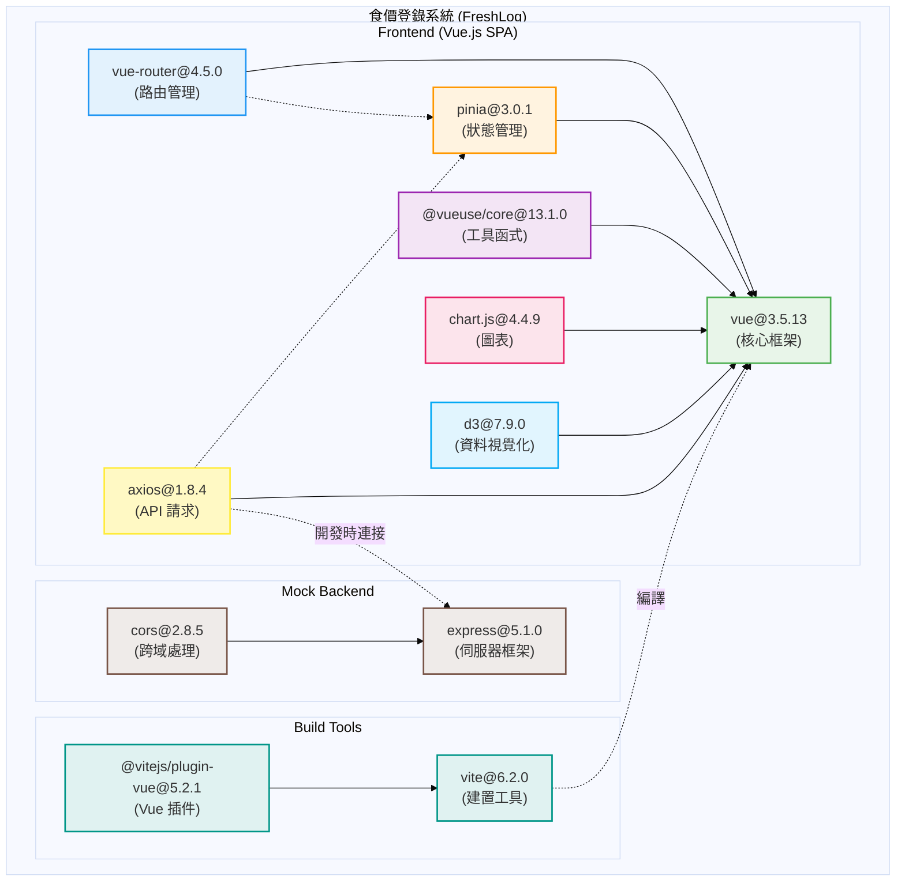

# 7-2 套件說明

## 一、前端專案架構概覽

食價登錄系統 (FreshLog) 是一個基於 Vue.js 3 的單頁應用程式 (SPA)，採用現代化前端技術堆疊，包含完整的狀態管理、路由系統、資料視覺化與 API 整合能力。

---

## 二、UML 套件圖

### 2.1 完整套件依賴圖（使用 PlantUML 語法）

```plantuml
@startuml FreshLog套件架構圖

!define PACKAGE_CORE #E8F5E9
!define PACKAGE_ROUTING #E3F2FD
!define PACKAGE_STATE #FFF3E0
!define PACKAGE_UTIL #F3E5F5
!define PACKAGE_CHART #FCE4EC
!define PACKAGE_DATA #E1F5FE
!define PACKAGE_API #FFF9C4
!define PACKAGE_MOCK #EFEBE9
!define PACKAGE_BUILD #E0F2F1

title 食價登錄系統 (FreshLog) - 前端套件架構圖

package "食價登錄系統 (FreshLog)" {

  package "Frontend (Vue.js SPA)" {

    ' 核心框架層
    package "vue@3.5.13 (核心框架)" as VueCore PACKAGE_CORE {
      note right
        - Composition API
        - Reactive System
        - Virtual DOM
        - Component System
      end note
    }

    ' 路由管理層
    package "vue-router@4.5.0 (路由管理)" as VueRouter PACKAGE_ROUTING {
      note right
        - History Mode
        - Route Guards
        - Lazy Loading
        - Named Routes
      end note
    }

    ' 狀態管理層
    package "pinia@3.0.1 (狀態管理)" as Pinia PACKAGE_STATE {
      note right
        - Store 定義
        - Actions / Getters
        - State Persistence
        - Dev Tools 支援
      end note
    }

    ' 工具函式層
    package "@vueuse/core@13.1.0 (工具函式)" as VueUse PACKAGE_UTIL {
      note right
        - Composables
        - Utility Hooks
        - Browser APIs
        - Animation Helpers
      end note
    }

    ' 圖表層
    package "chart.js@4.4.9 (圖表)" as ChartJS PACKAGE_CHART {
      note right
        - Line Chart
        - Bar Chart
        - 價格趨勢圖
        - 響應式圖表
      end note
    }

    ' 資料視覺化層
    package "d3@7.9.0 (資料視覺化)" as D3 PACKAGE_DATA {
      note right
        - SVG 操作
        - 資料綁定
        - 動態圖表
        - 市場趨勢圖
      end note
    }

    ' API 請求層
    package "axios@1.8.4 (API 請求)" as Axios PACKAGE_API {
      note right
        - HTTP Client
        - Interceptors
        - JWT Token 管理
        - Error Handling
      end note
    }
  }

  ' Mock 後端層
  package "Mock Backend" PACKAGE_MOCK {
    package "express@5.1.0 (伺服器框架)" as Express {
      note right
        - RESTful API
        - Middleware
        - Route Handling
        - 開發測試用
      end note
    }

    package "cors@2.8.5 (跨域處理)" as Cors {
      note right
        - CORS Headers
        - 允許跨域請求
        - 開發環境設定
      end note
    }
  }

  ' 建置工具層
  package "Build Tools" PACKAGE_BUILD {
    package "vite@6.2.0 (建置工具)" as Vite {
      note right
        - 開發伺服器
        - HMR (熱模組替換)
        - 打包最佳化
        - TypeScript 支援
      end note
    }

    package "@vitejs/plugin-vue@5.2.1 (Vue 插件)" as VitePluginVue {
      note right
        - .vue 檔案編譯
        - SFC 支援
        - 模板轉換
      end note
    }
  }
}

' 依賴關係定義
VueCore <-- VueRouter : 依賴
VueCore <-- Pinia : 依賴
VueCore <-- VueUse : 依賴
VueCore <-- ChartJS : 整合
VueCore <-- D3 : 整合
VueCore <-- Axios : 整合

VueRouter ..> Pinia : 使用
Axios ..> Pinia : 使用 (Token)

Express <-- Cors : 依賴
Axios ..> Express : 開發時連接

Vite <-- VitePluginVue : 依賴
Vite ..> VueCore : 編譯

legend right
  |= 符號 |= 說明 |
  | <-- | 直接依賴 |
  | ..> | 間接使用 |
endlegend

@enduml
```

---

### 2.2 簡化版套件分層圖（使用 Mermaid 語法）



---

## 三、套件分類說明

### 3.1 核心框架層 (Core Framework)

#### vue@3.5.13
- **用途**：前端核心框架
- **功能特性**：
  - Composition API 支援
  - Reactive 響應式系統
  - Virtual DOM 高效渲染
  - 元件化開發
  - 模板語法與指令系統
- **專案應用**：
  - 所有 `.vue` 元件的基礎
  - `<script setup>` 語法糖
  - `ref`, `reactive`, `computed`, `watch` 等核心 API

---

### 3.2 路由管理層 (Routing)

#### vue-router@4.5.0
- **用途**：單頁應用路由管理
- **功能特性**：
  - HTML5 History Mode
  - 路由守衛 (Navigation Guards)
  - 懶加載 (Lazy Loading)
  - 命名路由與巢狀路由
- **專案應用**：
  - `/src/router/index.js` 路由配置
  - `beforeEach` 全域守衛（登入驗證）
  - `redirectAfterLogin` 機制
  - 動態路由參數（如 `/veggie/:id`）

**關鍵路由配置**：
```javascript
// 路由守衛範例
router.beforeEach((to, from, next) => {
  const isLoggedIn = !!(token && userId && userName)
  const requiresAuth = protectedPaths.includes(to.path)

  if (!isLoggedIn && requiresAuth) {
    localStorage.setItem('redirectAfterLogin', to.fullPath)
    return next('/member/login')
  }
  next()
})
```

---

### 3.3 狀態管理層 (State Management)

#### pinia@3.0.1
- **用途**：全域狀態管理
- **功能特性**：
  - 模組化 Store 定義
  - Actions / Getters 支援
  - Vue DevTools 整合
  - TypeScript 友善
- **專案應用**：
  - `/src/store/user.js` 使用者狀態管理
  - 登入狀態 (`isAuthenticated`)
  - Token / UserId / UserName 管理
  - localStorage 同步

**Store 結構範例**：
```javascript
export const useUserStore = defineStore('user', {
  state: () => ({
    token: localStorage.getItem('userToken') || '',
    userId: Number(localStorage.getItem('userId')) || null,
    userName: localStorage.getItem('userName') || '',
    userRole: localStorage.getItem('userRole') || 'consumer',
    isAuthenticated: false
  }),
  actions: {
    setToken(token) { /* ... */ },
    logout() { /* ... */ }
  }
})
```

---

### 3.4 工具函式層 (Utilities)

#### @vueuse/core@13.1.0
- **用途**：Vue Composition Utilities 工具集
- **功能特性**：
  - 常用 Composables（如 `useStorage`, `useFetch`）
  - 瀏覽器 API 封裝
  - 動畫與過渡輔助
  - 響應式工具函式
- **專案應用**：
  - 可用於表單驗證、本地儲存、網路狀態檢測等
  - 增強開發效率

---

### 3.5 資料視覺化層 (Data Visualization)

#### chart.js@4.4.9
- **用途**：圖表繪製函式庫
- **功能特性**：
  - 折線圖 (Line Chart)
  - 柱狀圖 (Bar Chart)
  - 響應式設計
  - 動畫效果
- **專案應用**：
  - `PriceTrendChart.vue` 價格趨勢折線圖
  - 30天/90天價格走勢視覺化
  - 自訂配色與 tooltip

**Chart.js 應用範例**：
```javascript
new Chart(ctx, {
  type: 'line',
  data: {
    labels: dates,
    datasets: [{
      label: '價格趨勢',
      data: prices,
      borderColor: '#4CAF50',
      backgroundColor: 'rgba(76, 175, 80, 0.1)',
      tension: 0.4
    }]
  },
  options: {
    responsive: true,
    maintainAspectRatio: false
  }
})
```

#### d3@7.9.0
- **用途**：進階資料視覺化
- **功能特性**：
  - SVG 操作與資料綁定
  - 複雜圖表與動態效果
  - 自訂圖表元素
  - 資料轉換與比例尺
- **專案應用**：
  - `MarketTrendCard.vue` 市場趨勢長條圖
  - 使用 `d3.select`, `d3.scaleLinear`, `d3.axisBottom` 等 API
  - SVG 動態渲染

**D3.js 應用範例**：
```javascript
const svg = d3.select(chartRef.value)
  .append('svg')
  .attr('width', width)
  .attr('height', height)

const xScale = d3.scaleBand()
  .domain(data.map(d => d.date))
  .range([0, width])
  .padding(0.1)

const yScale = d3.scaleLinear()
  .domain([0, d3.max(data, d => d.price)])
  .range([height, 0])

svg.selectAll('rect')
  .data(data)
  .enter()
  .append('rect')
  .attr('x', d => xScale(d.date))
  .attr('y', d => yScale(d.price))
  .attr('width', xScale.bandwidth())
  .attr('height', d => height - yScale(d.price))
  .attr('fill', '#4CAF50')
```

---

### 3.6 API 請求層 (API Integration)

#### axios@1.8.4
- **用途**：HTTP 請求客戶端
- **功能特性**：
  - Promise-based API
  - Request / Response 攔截器
  - 自動 JSON 轉換
  - 錯誤處理
- **專案應用**：
  - `/src/api/client.js` 統一配置
  - JWT Token 自動注入
  - 401 自動登出處理
  - API 端點封裝（`recipe.js`, `food.js`, `favorite.js`, `member.js`）

**Axios 配置範例**：
```javascript
const apiClient = axios.create({
  baseURL: import.meta.env.VITE_API_BASE_URL || 'https://freshlog-api.ttshow.tw',
  timeout: 10000,
  headers: { 'Content-Type': 'application/json' }
})

// Request 攔截器：注入 Token
apiClient.interceptors.request.use((config) => {
  const token = useUserStore().token
  if (token) {
    config.headers.Authorization = `Bearer ${token}`
  }
  return config
})

// Response 攔截器：處理 401
apiClient.interceptors.response.use(
  (response) => response,
  (error) => {
    if (error.response?.status === 401) {
      useUserStore().logout()
      window.location.href = '/member/login'
    }
    return Promise.reject(error)
  }
)
```

---

### 3.7 Mock 後端層 (Mock Backend)

#### express@5.1.0
- **用途**：Node.js 伺服器框架
- **功能特性**：
  - RESTful API 建立
  - Middleware 支援
  - 路由處理
  - 開發測試用 Mock API
- **專案應用**：
  - `/mock/mock-server.js` 開發測試伺服器
  - 模擬食譜、蔬菜、會員 API 端點
  - 快速原型開發

#### cors@2.8.5
- **用途**：跨域資源共享處理
- **功能特性**：
  - CORS Headers 設定
  - 允許跨域請求
  - 開發環境配置
- **專案應用**：
  - 與 Express 整合，允許前端跨域請求
  - 開發模式下解決 CORS 問題

**Mock Server 範例**：
```javascript
const express = require('express')
const cors = require('cors')
const app = express()

app.use(cors())
app.use(express.json())

app.get('/api/recipe/list', (req, res) => {
  res.json({
    code: '0000',
    data: { items: [/* ... */] }
  })
})

app.listen(3000, () => {
  console.log('Mock server running on http://localhost:3000')
})
```

---

### 3.8 建置工具層 (Build Tools)

#### vite@6.2.0
- **用途**：現代化前端建置工具
- **功能特性**：
  - 快速開發伺服器（基於 ES Modules）
  - HMR (熱模組替換)
  - 生產打包最佳化
  - TypeScript 支援
  - 插件生態系統
- **專案應用**：
  - `vite.config.js` 配置檔案
  - 開發命令：`npm run dev`
  - 打包命令：`npm run build`
  - 預覽命令：`npm run preview`

**Vite 配置範例**：
```javascript
import { defineConfig } from 'vite'
import vue from '@vitejs/plugin-vue'

export default defineConfig({
  plugins: [vue()],
  resolve: {
    alias: {
      '@': '/src'
    }
  },
  server: {
    port: 5173,
    proxy: {
      '/api': {
        target: 'https://freshlog-api.ttshow.tw',
        changeOrigin: true
      }
    }
  }
})
```

#### @vitejs/plugin-vue@5.2.1
- **用途**：Vite 的 Vue.js 插件
- **功能特性**：
  - `.vue` 單檔案元件編譯
  - `<script setup>` 支援
  - 模板語法轉換
  - HMR 支援
- **專案應用**：
  - 與 Vite 整合，支援 Vue 3 開發
  - 自動處理 SFC 編譯

---

## 四、套件依賴關係說明

### 4.1 核心依賴鏈

```
vite (建置工具)
  ├─ @vitejs/plugin-vue (編譯 Vue 元件)
  └─ vue (核心框架)
       ├─ vue-router (路由管理)
       ├─ pinia (狀態管理)
       ├─ @vueuse/core (工具函式)
       ├─ chart.js (圖表)
       ├─ d3 (資料視覺化)
       └─ axios (API 請求)
```

### 4.2 開發依賴鏈

```
express (Mock 伺服器)
  └─ cors (跨域處理)
```

### 4.3 交互依賴關係

| 套件 A | 依賴關係 | 套件 B | 說明 |
|--------|---------|--------|------|
| vue-router | 使用 → | pinia | 路由守衛中檢查登入狀態 |
| axios | 使用 → | pinia | Request 攔截器注入 Token |
| chart.js | 整合 → | vue | 在 Vue 元件中渲染圖表 |
| d3 | 整合 → | vue | 在 Vue 元件中操作 SVG |
| axios | 連接 → | express | 開發時連接 Mock API |
| vite | 編譯 → | vue | 打包與開發時編譯 Vue 元件 |

---

## 五、套件版本資訊表

### 5.1 生產環境依賴 (dependencies)

| 套件名稱 | 版本號 | 類型 | 用途 |
|---------|--------|------|------|
| vue | 3.5.13 | 核心框架 | 前端核心框架，提供 Composition API 與響應式系統 |
| vue-router | 4.5.0 | 路由管理 | SPA 路由管理，支援 History Mode 與路由守衛 |
| pinia | 3.0.1 | 狀態管理 | 全域狀態管理，取代 Vuex 的新一代方案 |
| @vueuse/core | 13.1.0 | 工具函式 | Vue Composition Utilities 工具集 |
| chart.js | 4.4.9 | 資料視覺化 | 圖表繪製函式庫，用於價格趨勢圖 |
| d3 | 7.9.0 | 資料視覺化 | 進階資料視覺化函式庫，用於市場趨勢圖 |
| axios | 1.8.4 | HTTP 客戶端 | API 請求客戶端，支援攔截器與 JWT 管理 |
| express | 5.1.0 | 伺服器框架 | Node.js 伺服器框架，用於 Mock Backend |
| cors | 2.8.5 | 跨域處理 | CORS 中介軟體，解決開發時跨域問題 |
| env-cmd | 10.1.0 | 環境變數 | 環境變數管理工具 |

### 5.2 開發環境依賴 (devDependencies)

| 套件名稱 | 版本號 | 類型 | 用途 |
|---------|--------|------|------|
| vite | 6.2.0 | 建置工具 | 現代化建置工具，提供快速開發伺服器與打包 |
| @vitejs/plugin-vue | 5.2.1 | Vite 插件 | Vite 的 Vue.js 插件，支援 SFC 編譯 |

---

## 六、套件使用範例

### 6.1 Vue 核心 (vue@3.5.13)

```vue
<template>
  <div class="example">
    <h2>{{ title }}</h2>
    <p>計數：{{ count }}</p>
    <button @click="increment">+1</button>
  </div>
</template>

<script setup>
import { ref, computed } from 'vue'

const count = ref(0)
const title = computed(() => `目前計數：${count.value}`)

function increment() {
  count.value++
}
</script>
```

### 6.2 Vue Router (vue-router@4.5.0)

```javascript
import { createRouter, createWebHistory } from 'vue-router'

const router = createRouter({
  history: createWebHistory(),
  routes: [
    {
      path: '/',
      name: 'Home',
      component: () => import('@/views/ConsumerHome.vue')
    },
    {
      path: '/veggie/:id',
      name: 'VeggieDetail',
      component: () => import('@/views/VeggieDetailPage.vue')
    }
  ]
})

// 路由守衛
router.beforeEach((to, from, next) => {
  // 驗證邏輯
  next()
})

export default router
```

### 6.3 Pinia (pinia@3.0.1)

```javascript
import { defineStore } from 'pinia'

export const useUserStore = defineStore('user', {
  state: () => ({
    token: '',
    userId: null,
    isAuthenticated: false
  }),

  getters: {
    userInfo: (state) => ({
      id: state.userId,
      isLoggedIn: state.isAuthenticated
    })
  },

  actions: {
    setToken(token) {
      this.token = token
      this.isAuthenticated = !!token
      localStorage.setItem('userToken', token)
    },

    logout() {
      this.token = ''
      this.userId = null
      this.isAuthenticated = false
      localStorage.removeItem('userToken')
    }
  }
})
```

### 6.4 Axios (axios@1.8.4)

```javascript
import axios from 'axios'
import { useUserStore } from '@/store/user'

const apiClient = axios.create({
  baseURL: 'https://freshlog-api.ttshow.tw',
  timeout: 10000
})

// Request 攔截器
apiClient.interceptors.request.use((config) => {
  const token = useUserStore().token
  if (token) {
    config.headers.Authorization = `Bearer ${token}`
  }
  return config
})

// Response 攔截器
apiClient.interceptors.response.use(
  (response) => response,
  (error) => {
    if (error.response?.status === 401) {
      useUserStore().logout()
      window.location.href = '/member/login'
    }
    return Promise.reject(error)
  }
)

export default apiClient
```

### 6.5 Chart.js (chart.js@4.4.9)

```javascript
import { Chart } from 'chart.js/auto'

const chartData = {
  labels: ['1/1', '1/2', '1/3', '1/4', '1/5'],
  datasets: [{
    label: '價格',
    data: [30, 35, 32, 38, 36],
    borderColor: '#4CAF50',
    backgroundColor: 'rgba(76, 175, 80, 0.1)',
    tension: 0.4
  }]
}

const chart = new Chart(ctx, {
  type: 'line',
  data: chartData,
  options: {
    responsive: true,
    plugins: {
      legend: { display: true },
      tooltip: { enabled: true }
    }
  }
})
```

### 6.6 D3.js (d3@7.9.0)

```javascript
import * as d3 from 'd3'

const data = [
  { date: '1/1', price: 30 },
  { date: '1/2', price: 35 },
  { date: '1/3', price: 32 }
]

const svg = d3.select(chartRef.value)
  .append('svg')
  .attr('width', 400)
  .attr('height', 300)

const xScale = d3.scaleBand()
  .domain(data.map(d => d.date))
  .range([0, 400])
  .padding(0.1)

const yScale = d3.scaleLinear()
  .domain([0, d3.max(data, d => d.price)])
  .range([300, 0])

svg.selectAll('rect')
  .data(data)
  .enter()
  .append('rect')
  .attr('x', d => xScale(d.date))
  .attr('y', d => yScale(d.price))
  .attr('width', xScale.bandwidth())
  .attr('height', d => 300 - yScale(d.price))
  .attr('fill', '#4CAF50')
```

---

## 七、套件更新與維護建議

### 7.1 定期更新策略

| 套件類型 | 更新頻率 | 風險等級 | 建議策略 |
|---------|---------|---------|---------|
| 核心框架 (Vue) | 每季檢查 | 中 | 關注 Breaking Changes，測試後升級 |
| 路由/狀態管理 | 每半年檢查 | 低 | 穩定版本，小版本可直接升級 |
| 視覺化函式庫 | 每年檢查 | 低 | 功能穩定，無重大問題不建議升級 |
| 建置工具 (Vite) | 每季檢查 | 中 | 關注效能改進，測試後升級 |
| API 客戶端 (Axios) | 每半年檢查 | 低 | 穩定套件，安全性更新優先 |

### 7.2 相容性檢查清單

更新套件前需檢查：

1. **Vue 核心更新**
   - [ ] Composition API 變更
   - [ ] 模板語法相容性
   - [ ] 生命週期變更
   - [ ] DevTools 支援

2. **Vue Router 更新**
   - [ ] 路由配置語法
   - [ ] Navigation Guards API
   - [ ] History Mode 設定

3. **Pinia 更新**
   - [ ] Store 定義語法
   - [ ] Actions / Getters 變更
   - [ ] Plugin API 變更

4. **Vite 更新**
   - [ ] 配置檔案語法
   - [ ] Plugin 相容性
   - [ ] 打包輸出格式

5. **Chart.js / D3.js 更新**
   - [ ] API 變更
   - [ ] 圖表配置格式
   - [ ] 響應式行為

### 7.3 安全性更新

定期檢查安全性漏洞：

```bash
# 檢查套件漏洞
npm audit

# 修復可自動修復的漏洞
npm audit fix

# 查看過期套件
npm outdated

# 更新所有套件到最新版本（謹慎使用）
npm update
```

---

## 八、套件效能分析

### 8.1 打包體積分析

| 套件 | 預估大小 (gzip) | 影響等級 | 最佳化建議 |
|------|----------------|---------|-----------|
| vue | ~50 KB | 核心 | 不可移除 |
| vue-router | ~10 KB | 核心 | 使用路由懶加載 |
| pinia | ~3 KB | 核心 | 體積小，保持使用 |
| chart.js | ~60 KB | 大 | 考慮按需引入，或使用輕量替代 |
| d3 | ~80 KB | 大 | 只引入使用的模組 (如 d3-scale) |
| axios | ~15 KB | 中 | 體積適中，保持使用 |
| @vueuse/core | ~20 KB | 中 | 按需引入使用的函式 |

### 8.2 最佳化建議

#### D3.js 按需引入
```javascript
// ❌ 不推薦：引入完整 D3
import * as d3 from 'd3'

// ✅ 推薦：只引入需要的模組
import { select } from 'd3-selection'
import { scaleLinear, scaleBand } from 'd3-scale'
import { axisBottom, axisLeft } from 'd3-axis'
```

#### Chart.js 按需引入
```javascript
// ✅ 推薦：使用 Tree-shaking
import {
  Chart,
  LineController,
  LineElement,
  PointElement,
  LinearScale,
  CategoryScale,
  Tooltip,
  Legend
} from 'chart.js'

Chart.register(
  LineController,
  LineElement,
  PointElement,
  LinearScale,
  CategoryScale,
  Tooltip,
  Legend
)
```

#### 路由懶加載
```javascript
// ✅ 使用動態引入
const routes = [
  {
    path: '/veggie/:id',
    component: () => import('@/views/VeggieDetailPage.vue')
  }
]
```

---

## 九、開發指令說明

### 9.1 NPM Scripts

| 指令 | 功能說明 | 使用套件 |
|------|---------|---------|
| `npm run dev` | 啟動開發伺服器 | vite |
| `npm run build` | 打包生產版本 | vite |
| `npm run preview` | 預覽打包結果 | vite |
| `npm run mock` | 啟動 Mock API 伺服器 | express, cors |

### 9.2 指令詳細說明

#### 開發模式
```bash
npm run dev
```
- 啟動 Vite 開發伺服器（預設 `http://localhost:5173`）
- 支援 HMR (熱模組替換)
- 自動編譯 `.vue` 檔案
- 使用 `vite.config.js` 配置

#### 生產打包
```bash
npm run build
```
- 使用 Vite 打包為生產版本
- 輸出至 `dist/` 目錄
- 自動進行 Tree-shaking、Code splitting、壓縮

#### 預覽打包結果
```bash
npm run preview
```
- 在本地預覽打包後的結果
- 模擬生產環境運行

#### Mock API 伺服器
```bash
npm run mock
```
- 啟動 Express Mock 伺服器（預設 `http://localhost:3000`）
- 提供開發測試用 API 端點
- 支援 CORS 跨域請求

---

## 十、環境變數配置

### 10.1 Vite 環境變數

專案使用 Vite 的環境變數系統，支援 `.env` 檔案：

```bash
# .env
VITE_API_BASE_URL=https://freshlog-api.ttshow.tw

# .env.development
VITE_API_BASE_URL=http://localhost:3000

# .env.production
VITE_API_BASE_URL=https://freshlog-api.ttshow.tw
```

### 10.2 存取環境變數

```javascript
// 在 JavaScript 中存取
const apiBaseUrl = import.meta.env.VITE_API_BASE_URL

// 在 Axios 配置中使用
const apiClient = axios.create({
  baseURL: import.meta.env.VITE_API_BASE_URL || 'https://freshlog-api.ttshow.tw'
})
```

---

## 十一、總結

食價登錄系統 (FreshLog) 採用現代化前端技術堆疊，以 **Vue 3** 為核心，搭配 **Vite** 建置工具，提供快速的開發體驗與高效的生產打包。透過 **Vue Router** 實現 SPA 路由管理，使用 **Pinia** 進行全域狀態管理，並整合 **Chart.js** 與 **D3.js** 實現豐富的資料視覺化功能。**Axios** 作為 HTTP 客戶端，提供完整的 JWT 認證與錯誤處理機制。

專案結構清晰，套件依賴關係明確，具備良好的可維護性與可擴展性。透過本文件的 UML 套件圖與詳細說明，開發團隊可快速了解專案架構，並進行後續的開發與維護工作。

---

## 附錄：完整套件列表

```json
{
  "dependencies": {
    "@vueuse/core": "^13.1.0",
    "axios": "^1.8.4",
    "chart.js": "^4.4.9",
    "cors": "^2.8.5",
    "d3": "^7.9.0",
    "env-cmd": "^10.1.0",
    "express": "^5.1.0",
    "pinia": "^3.0.1",
    "vue": "^3.5.13",
    "vue-router": "^4.5.0"
  },
  "devDependencies": {
    "@vitejs/plugin-vue": "^5.2.1",
    "vite": "^6.2.0"
  }
}
```

---

**文件版本**：1.0
**最後更新**：2025-01-27
**維護者**：FreshLog 開發團隊
