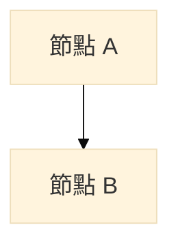
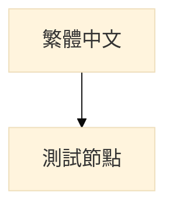
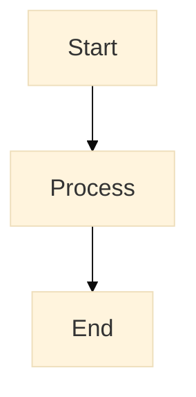
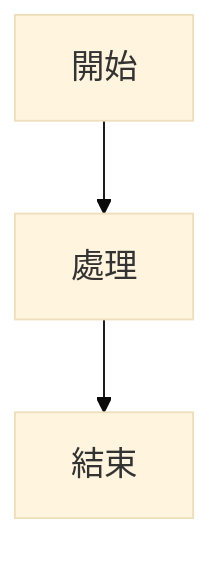
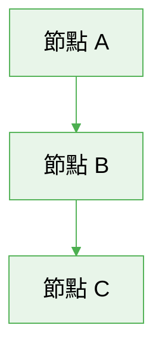
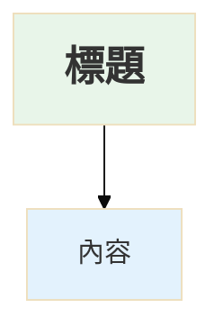
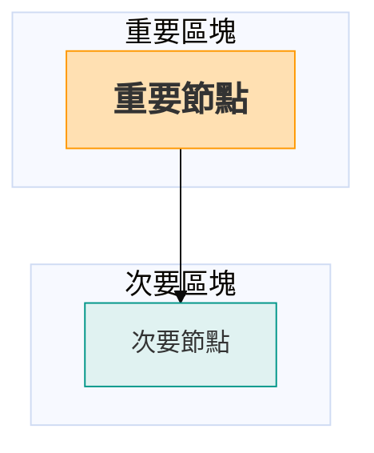
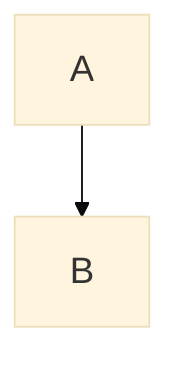
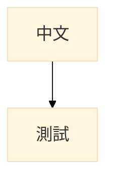
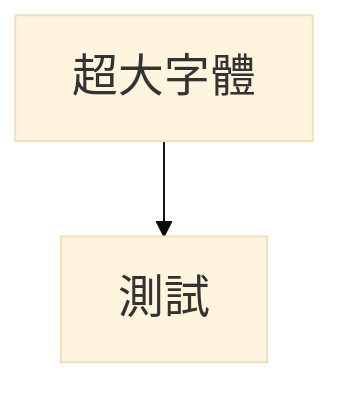

# Mermaid 字體設定指南

## 快速設定

在 Mermaid 圖表開頭加入以下設定即可調整字體大小：



## 常用字體大小

| 字體大小 | 適用場景 |
|---------|---------|
| `14px` | 預設大小（較小，不建議） |
| `16px` | 標準大小 |
| `18px` | **推薦大小**（本專案使用） |
| `20px` | 簡報用 |
| `22px` | 投影片用 |

## 繁體中文字體設定



## 完整範例

### 基本設定（英文）



### 繁體中文設定



### 自訂顏色 + 字體



## 進階技巧

### 針對特定節點調整字體



### 不同區塊使用不同樣式



## 線上測試工具

1. **Mermaid Live Editor**：https://mermaid.live/
   - 即時預覽
   - 可匯出 PNG/SVG

2. **VS Code 插件**：Markdown Preview Mermaid Support
   - 在編輯器中直接預覽

## 常見問題

### Q1：字體沒有變大？

**原因**：
- `%%{init: {...}}%%` 必須在圖表第一行
- 語法錯誤（缺少引號或逗號）
- Mermaid 版本過舊（需 v8.6.0+）

**解決方法**：


### Q2：繁體中文顯示為方塊？

**解決方法**：


### Q3：想要更大的字體？

直接修改 `fontSize` 參數：



## 本專案使用的設定

**7-2_套件說明.md** 和 **7-3_元件說明.md** 中的 Mermaid 圖表統一使用：

```mermaid
%%{init: {'theme':'base', 'themeVariables': { 'fontSize':'18px', 'fontFamily':'Arial'}}}%%
```

如需調整，只需修改 `fontSize` 值即可（例如改為 `'20px'` 或 `'22px'`）。

---

**建議設定**：
- **一般文件**：`fontSize: '18px'`
- **簡報投影**：`fontSize: '20px'` - `'24px'`
- **列印輸出**：`fontSize: '16px'` - `'18px'`

**字體選擇**：
- **英文**：`'Arial'` 或 `'Helvetica'`
- **繁體中文**：`'Microsoft JhengHei, Noto Sans TC, sans-serif'`
- **跨平台**：`'sans-serif'`（使用系統預設字體）
