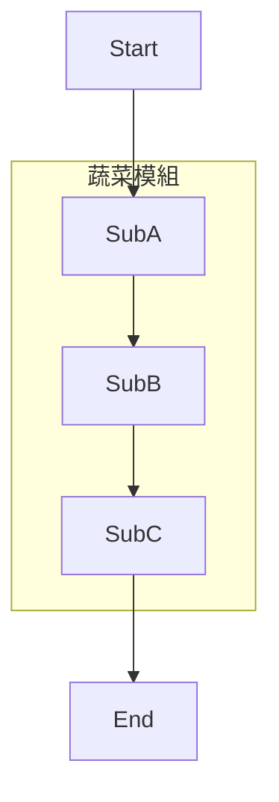
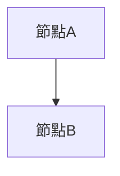

# FreshLog 消費者UML活動圖 - Mermaid版本使用說明

## 檔案資訊
- **檔案名稱**: `UML_Activity_Diagram_Consumer.mmd`
- **格式**: Mermaid
- **主題**: FreshLog網站消費者完整活動圖
- **符合標準**: UML 2.5規範

---

## 為什麼選擇Mermaid？

### Mermaid的優勢

✅ **即時預覽** - 無需額外軟體，直接在各平台查看
✅ **廣泛支援** - GitHub、GitLab、Notion、VSCode、Obsidian等
✅ **語法簡單** - 比PlantUML更容易學習和修改
✅ **版本控制友好** - 純文字格式，易於Git追蹤
✅ **免費開源** - 完全免費，活躍的社群支援
✅ **多種匯出** - PNG、SVG、PDF等格式

---

## 快速開始（5種方法）

### 方法一：GitHub直接預覽 ⭐ **最簡單！**

1. 將 `.mmd` 檔案上傳到GitHub倉庫

2. GitHub會自動渲染Mermaid圖表

3. 或者創建一個 `README.md`，加入以下內容：

````markdown
# FreshLog 消費者活動圖

```mermaid
[將 .mmd 檔案的內容貼到這裡]
```
````

4. GitHub會自動顯示圖表！

### 方法二：線上Mermaid編輯器 ⭐ **推薦！**

1. 開啟 **Mermaid Live Editor**: https://mermaid.live/

2. 開啟 `UML_Activity_Diagram_Consumer.mmd` 檔案

3. 複製所有內容

4. 貼到左側編輯區

5. 右側會即時顯示圖表

6. 點擊「Actions」可以：
   - 📥 Download PNG
   - 📥 Download SVG
   - 📥 Download as Markdown
   - 🔗 Copy link to share

### 方法三：Visual Studio Code ⭐ **開發者推薦！**

1. 安裝VSCode

2. 安裝擴充套件：
   - **Markdown Preview Mermaid Support** (作者: Matt Bierner)
   - 或 **Mermaid Preview** (作者: Yaroslav Kukhar)

3. 創建一個 Markdown 檔案，例如 `activity_diagram.md`

4. 在檔案中加入：

````markdown
# FreshLog 活動圖

```mermaid
[將 .mmd 檔案的內容貼到這裡]
```
````

5. 按 `Ctrl + Shift + V` 預覽

6. 或直接開啟 `.mmd` 檔案，使用「Mermaid Preview」擴充套件預覽

### 方法四：Notion

1. 在Notion頁面中輸入 `/code`

2. 選擇「Code block」

3. 選擇語言為 `mermaid`

4. 貼上 `.mmd` 檔案內容

5. Notion會自動渲染圖表！

### 方法五：GitLab

GitLab內建Mermaid支援，方法與GitHub相同：

1. 在 `README.md` 或任何 `.md` 檔案中使用：

````markdown
```mermaid
[Mermaid代碼]
```
````

2. GitLab會自動渲染

---

## 如何匯出圖表

### 高品質圖片（用於報告）

#### 使用 Mermaid Live Editor（推薦）

1. 前往 https://mermaid.live/
2. 貼上代碼
3. 點擊「Actions」→「Download PNG」
   - **300 DPI** 適合列印
   - **150 DPI** 適合螢幕顯示

4. 或下載 **SVG** 格式（向量圖，可無限放大）

#### 使用 Mermaid CLI

安裝 Mermaid CLI：
```bash
npm install -g @mermaid-js/mermaid-cli
```

匯出PNG：
```bash
mmdc -i UML_Activity_Diagram_Consumer.mmd -o diagram.png -w 3000 -H 4000
```

匯出SVG：
```bash
mmdc -i UML_Activity_Diagram_Consumer.mmd -o diagram.svg
```

匯出PDF：
```bash
mmdc -i UML_Activity_Diagram_Consumer.mmd -o diagram.pdf
```

---

## 圖表結構說明

### 4個主要功能模組

本活動圖分為4個主要流程：

#### 1. 🥬 蔬菜瀏覽與搜尋
- **並行篩選**（5個條件可同時設定）：
  - 分類篩選（葉菜類/根莖類/雜糧類/其他）
  - 價格範圍（0-200元滑桿）
  - 營養篩選（維生素A/C、鈣、鐵、抗氧化）
  - 特色篩選（抗氧化/補鈣/護眼/能量/超級食物）
  - 名稱搜尋（中英文自動判斷）
- 排序功能（3種）
- 分頁瀏覽（每頁6項）
- 蔬菜詳細頁
- 收藏與價格追蹤（需登入）

#### 2. 🍳 食譜瀏覽與查詢
- **並行篩選**（5個條件可同時設定）：
  - 烹調時間（15分/30分/1小時）
  - 難易度（簡單/中等/困難）
  - 特色（素食/其他）
  - 分類（湯品/蔬菜/甜點/沙拉/肉類/飯類）
  - 名稱搜尋
- 排序功能（5種）
- 分頁瀏覽（每頁20項）
- 食譜詳細頁
- 食譜收藏（需登入）

#### 3. 👤 會員功能
- **登入方式**（3種）：
  - 一般登入（帳號+密碼+驗證碼）
  - Google OAuth登入
  - 註冊新帳號
- 忘記密碼流程
- **會員中心**（4個標籤）：
  - 個人資訊編輯
  - 食譜收藏管理
  - 蔬菜收藏管理
  - 到價追蹤管理
- **追蹤設定**（6個並行設定）：
  - 價格變動通知
  - 新作物上架通知
  - 新食譜推薦通知
  - 農民更新通知
  - 價格門檻設定
  - 通知方式選擇

#### 4. 📊 市場資訊查詢
- 食安快訊
- 禽產行情（開發中）
- 海產行情（開發中）

### 19個關鍵決策點

| # | 決策點 | 位置 | 說明 |
|---|--------|------|------|
| 1 | 選擇功能模組 | 首頁 | 蔬菜/食譜/會員/市場資訊 |
| 2 | 需要翻頁？(蔬菜) | 蔬菜列表 | 分頁控制 |
| 3 | 是否查看詳情？(蔬菜) | 蔬菜列表 | 進入詳細頁 |
| 4 | 是否已登入？(蔬菜詳情) | 蔬菜詳細頁 | 權限檢查 |
| 5 | 操作選擇？(蔬菜) | 蔬菜詳細頁 | 收藏/追蹤/查看食譜 |
| 6 | 是否前往登入？ | 蔬菜詳細頁 | 未登入提示 |
| 7 | 需要翻頁？(食譜) | 食譜列表 | 分頁控制 |
| 8 | 是否查看食譜詳情？ | 食譜列表 | 進入詳細頁 |
| 9 | 是否已登入？(食譜詳情) | 食譜詳細頁 | 權限檢查 |
| 10 | 是否收藏食譜？ | 食譜詳細頁 | 收藏功能 |
| 11 | 是否查看相關食譜？ | 食譜詳細頁 | 推薦連結 |
| 12 | 是否已登入？(會員) | 會員模組入口 | 登入檢查 |
| 13 | 登入方式選擇？ | 登入頁 | 一般/Google/註冊 |
| 14 | 是否保持登入？ | 登入頁 | 記住登入狀態 |
| 15 | 驗證成功？(登入) | 登入處理 | 登入驗證 |
| 16 | 忘記密碼？ | 登入失敗 | 重設密碼流程 |
| 17 | 是否進入會員中心？ | 已登入狀態 | 個人資料管理 |
| 18 | 選擇功能標籤？ | 會員中心 | 4個標籤選擇 |
| 19 | 查詢類型？ | 市場資訊 | 食安/禽產/海產 |

### 並行處理區塊（3組）

Mermaid中使用 `[["🔀 標籤"]]` 表示並行的分叉和匯合：

1. **蔬菜篩選並行區**
   - 分叉：`FilterParallel`
   - 匯合：`FilterJoin`

2. **食譜篩選並行區**
   - 分叉：`RecipeFilterParallel`
   - 匯合：`RecipeFilterJoin`

3. **追蹤設定並行區**
   - 分叉：`FollowSettingParallel`
   - 匯合：`FollowSettingJoin`

---

## 如何修改圖表

### Mermaid語法基礎

#### 節點定義
```mermaid
NodeID[顯示文字]              %% 矩形
NodeID([圓角矩形])            %% 開始/結束
NodeID{菱形 - 決策}           %% 決策點
NodeID[["並行分叉/匯合"]]     %% 並行標記
```

#### 連接線
```mermaid
A --> B                       %% 單向箭頭
A -->|標籤文字| B             %% 帶標籤的箭頭
```

#### 多行文字
```mermaid
NodeID[第一行<br/>第二行<br/>第三行]
```

### 修改範例

#### 新增一個決策點
```mermaid
%% 在現有流程中插入
OldNode --> NewDecision{新的決策?}
NewDecision -->|選項A| NodeA
NewDecision -->|選項B| NodeB
```

#### 新增並行處理
```mermaid
Start --> Parallel[["🔀 並行開始"]]
Parallel --> Task1[任務1]
Parallel --> Task2[任務2]
Parallel --> Task3[任務3]

Task1 --> Join[["🔀 並行匯合"]]
Task2 --> Join
Task3 --> Join
Join --> Next[下一步]
```

#### 修改樣式
在檔案末尾修改 `classDef`：
```mermaid
classDef myStyle fill:#FF6B6B,stroke:#C92A2A,stroke-width:3px,color:#fff
class NodeID myStyle
```

---

## 顏色與樣式說明

目前圖表使用4種顏色標示：

| 類別 | 顏色 | 用途 | 節點 |
|------|------|------|------|
| **startEnd** | 綠色 (#4CAF50) | 開始/結束節點 | Start, FinalEnd, End1, End2 |
| **decision** | 橙色 (#FFF3E0) | 決策點 | 所有菱形節點 |
| **process** | 藍色 (#E3F2FD) | 一般活動 | 預設樣式 |
| **parallel** | 粉紅 (#FCE4EC) | 並行分叉/匯合 | FilterParallel, FilterJoin等 |
| **important** | 紅色 (#FFEBEE) | 重要頁面 | LoginPage, RegisterPage等 |

### 自訂顏色

修改 `classDef` 定義：
```mermaid
classDef startEnd fill:#4CAF50,stroke:#2E7D32,stroke-width:3px,color:#fff
                    ↑背景色    ↑邊框色       ↑邊框寬度      ↑文字色
```

---

## 與PlantUML版本的比較

| 特性 | Mermaid | PlantUML |
|------|---------|----------|
| **語法難度** | ⭐⭐ 簡單 | ⭐⭐⭐ 中等 |
| **GitHub支援** | ✅ 原生支援 | ❌ 需要插件 |
| **VSCode預覽** | ✅ 輕量級擴充 | ⚠️ 需要Java+Graphviz |
| **線上編輯器** | ✅ 速度快 | ⚠️ 較慢 |
| **圖表複雜度** | ⭐⭐⭐ 適合中型圖 | ⭐⭐⭐⭐⭐ 適合大型圖 |
| **樣式自訂** | ⭐⭐⭐ 豐富 | ⭐⭐⭐⭐ 非常豐富 |
| **匯出品質** | ⭐⭐⭐⭐ 優秀 | ⭐⭐⭐⭐⭐ 卓越 |
| **學習曲線** | ⭐⭐ 平緩 | ⭐⭐⭐⭐ 陡峭 |
| **社群支援** | ⭐⭐⭐⭐ 活躍 | ⭐⭐⭐⭐ 成熟 |

### 建議使用場景

**選擇Mermaid，如果您：**
- ✅ 需要在GitHub/GitLab上直接顯示
- ✅ 希望快速上手，語法簡單
- ✅ 使用Notion、Obsidian等筆記軟體
- ✅ 圖表規模中小型（<100個節點）

**選擇PlantUML，如果您：**
- ✅ 需要極高的自訂性
- ✅ 圖表非常複雜（>100個節點）
- ✅ 需要生成其他類型的UML圖（類圖、序列圖等）
- ✅ 已有PlantUML開發環境

**我的建議：兩者都提供！**
- 在GitHub README使用Mermaid版本（方便查看）
- 在正式報告使用PlantUML版本（品質更高）

---

## 嵌入到報告中

### Word文件

1. 使用 Mermaid Live Editor 匯出為 **PNG (300 DPI)** 或 **SVG**
2. 在Word中「插入」→「圖片」
3. 建議使用SVG格式，可無限放大不失真

### PowerPoint簡報

1. 匯出為 **PNG (1920x1080)** 或更高解析度
2. 或匯出為 **SVG**（PowerPoint 2016+支援）
3. 插入圖片並調整大小

### LaTeX論文

使用 `graphicx` 套件插入PNG或PDF：
```latex
\usepackage{graphicx}

\begin{figure}[h]
  \centering
  \includegraphics[width=\textwidth]{diagram.png}
  \caption{FreshLog消費者活動圖}
  \label{fig:activity_diagram}
\end{figure}
```

或直接使用 `mermaid` 套件（需要XeLaTeX）：
```latex
\usepackage{mermaid}

\begin{mermaid}
  [Mermaid代碼]
\end{mermaid}
```

### HTML網頁

直接嵌入Mermaid代碼：
```html
<!DOCTYPE html>
<html>
<head>
  <script src="https://cdn.jsdelivr.net/npm/mermaid/dist/mermaid.min.js"></script>
  <script>mermaid.initialize({startOnLoad:true});</script>
</head>
<body>
  <div class="mermaid">
    [Mermaid代碼]
  </div>
</body>
</html>
```

---

## 常見問題（FAQ）

### Q1: Mermaid圖表顯示不出來？

**A**: 檢查以下幾點：
1. 確認使用的平台支援Mermaid（GitHub/GitLab/Notion等）
2. 確認代碼塊語言設定為 `mermaid`
3. 檢查語法是否有錯誤（使用 https://mermaid.live/ 驗證）
4. 在VSCode中確認安裝了Mermaid擴充套件

### Q2: 如何調整圖表大小？

**A**:
- **線上編輯器**: 使用縮放功能，然後下載指定解析度
- **Mermaid CLI**: 使用 `-w` 和 `-H` 參數指定寬度和高度
  ```bash
  mmdc -i input.mmd -o output.png -w 3000 -H 4000
  ```
- **嵌入網頁**: 使用CSS調整容器大小

### Q3: 中文顯示不正常？

**A**: 確保：
1. 檔案編碼為 **UTF-8**
2. 使用支援中文的字型（如Microsoft YaHei、微軟正黑體）
3. 在Mermaid配置中指定字型：
   ```javascript
   mermaid.initialize({
     fontFamily: 'Microsoft YaHei, Arial, sans-serif'
   });
   ```

### Q4: 如何修改節點間的距離？

**A**: Mermaid會自動佈局，但您可以：
1. 使用 `&nbsp;` 在文字中增加間距
2. 調整節點的文字長度
3. 使用子圖（subgraph）分組
4. 如果需要精確控制，建議改用PlantUML

### Q5: 可以匯出為可編輯的格式嗎？

**A**:
- **SVG**: 可用Inkscape、Adobe Illustrator編輯
- **DOT**: 使用Mermaid CLI匯出為Graphviz DOT格式
  ```bash
  mmdc -i input.mmd -o output.dot
  ```

### Q6: Mermaid支援哪些圖表類型？

**A**: Mermaid支援多種圖表：
- ✅ 流程圖 (Flowchart)
- ✅ 序列圖 (Sequence Diagram)
- ✅ 類圖 (Class Diagram)
- ✅ 狀態圖 (State Diagram)
- ✅ 實體關係圖 (ER Diagram)
- ✅ 甘特圖 (Gantt Chart)
- ✅ 圓餅圖 (Pie Chart)
- ✅ Git圖 (Git Graph)

### Q7: 評審會接受Mermaid生成的圖表嗎？

**A**: **絕對會！**理由：
1. ✅ Mermaid符合UML標準
2. ✅ 被GitHub、GitLab等主流平台支援
3. ✅ 輸出品質專業
4. ✅ 被學術界和工業界廣泛採用
5. ✅ 比手繪圖表更規範

---

## 進階技巧

### 1. 使用子圖分組



### 2. 自訂連接線樣式

```mermaid
A --> B                %% 實線
A -.-> B              %% 虛線
A ==> B               %% 粗線
A -->|標籤| B         %% 帶標籤
```

### 3. 連結到外部URL

```mermaid
click NodeID "https://example.com" "工具提示文字"
```

### 4. 添加註釋



---

## 學習資源

### 官方資源
- **官方網站**: https://mermaid.js.org/
- **線上編輯器**: https://mermaid.live/
- **GitHub倉庫**: https://github.com/mermaid-js/mermaid
- **官方文件**: https://mermaid.js.org/intro/

### 教學資源
- **流程圖語法**: https://mermaid.js.org/syntax/flowchart.html
- **入門教學**: https://mermaid.js.org/intro/getting-started.html
- **範例庫**: https://mermaid.js.org/ecosystem/integrations.html

### 互動式學習
- **Mermaid Live Editor**: https://mermaid.live/ (直接在線練習)
- **Mermaid Chart**: https://www.mermaidchart.com/ (進階圖表編輯器)

---

## 支援的平台完整列表

| 平台 | 支援方式 | 說明 |
|------|---------|------|
| **GitHub** | ✅ 原生 | 在Markdown中使用 ````mermaid```` |
| **GitLab** | ✅ 原生 | 同上 |
| **Notion** | ✅ 原生 | Code block選擇mermaid |
| **Obsidian** | ✅ 原生 | 同GitHub |
| **VSCode** | 🔌 擴充 | 安裝擴充套件 |
| **Typora** | ✅ 原生 | 直接支援 |
| **HackMD** | ✅ 原生 | 直接支援 |
| **Confluence** | 🔌 插件 | Mermaid for Confluence |
| **WordPress** | 🔌 插件 | WP Mermaid |
| **Jupyter** | 🔌 擴充 | IPython mermaid |

---

## 匯出清單（用於報告）

### 推薦格式

| 用途 | 格式 | 解析度/設定 | 工具 |
|------|------|------------|------|
| **學術報告** | PDF | 向量格式 | Mermaid CLI |
| **Word文件** | SVG | 向量格式 | Mermaid Live |
| **PowerPoint** | PNG | 1920x1080 | Mermaid Live |
| **網頁顯示** | SVG | 向量格式 | Mermaid Live |
| **列印** | PNG | 300 DPI | Mermaid Live |
| **海報** | PNG | 4K (3840x2160) | Mermaid CLI |

### 檔案大小比較

| 格式 | 檔案大小 | 優點 | 缺點 |
|------|---------|------|------|
| SVG | ~50-100 KB | 可縮放、小 | 某些舊軟體不支援 |
| PNG (150 DPI) | ~500 KB | 相容性好 | 放大會糊 |
| PNG (300 DPI) | ~1.5 MB | 高品質 | 檔案較大 |
| PDF | ~100 KB | 專業、可列印 | 不易編輯 |

---

## 後續優化建議

如果您需要進一步優化這個活動圖，可以考慮：

### 1. 分割為多個子圖

將大圖分割為4個獨立的圖表：
- `diagram_veggie.mmd` - 蔬菜模組
- `diagram_recipe.mmd` - 食譜模組
- `diagram_member.mmd` - 會員模組
- `diagram_market.mmd` - 市場資訊模組

### 2. 添加子圖（Subgraph）

使用Mermaid的subgraph功能分組：
```mermaid
subgraph "蔬菜瀏覽模組"
    [蔬菜相關節點]
end
```

### 3. 添加樣式主題

Mermaid支援多種內建主題：
```mermaid
%%{init: {'theme':'forest'}}%%
graph TD
    [圖表內容]
```

可用主題：`default`, `forest`, `dark`, `neutral`, `base`

### 4. 添加互動功能（網頁版）

```mermaid
click NodeID call callback() "工具提示"
```

---

## 授權聲明

此UML活動圖由Claude Code基於您的FreshLog專案代碼分析生成，專為您的報告使用。您可以：

✅ 用於學術報告、論文
✅ 用於專案文件
✅ 修改和調整
✅ 分享給團隊成員

❌ 請勿用於商業販售

---

## 版本資訊

- **版本**: 1.0 (Mermaid)
- **生成日期**: 2025-11-03
- **基於代碼版本**: Branch 1116424
- **符合標準**: UML 2.5
- **工具**: Mermaid
- **Mermaid版本**: 10.6.0+

---

## 與PlantUML版本的協同使用

**最佳實踐：兩個版本都使用！**

| 場景 | 使用版本 | 原因 |
|------|---------|------|
| GitHub README | Mermaid | 直接顯示，無需額外工具 |
| 開發中快速查看 | Mermaid | VSCode輕量級預覽 |
| 團隊協作 | Mermaid | 易於修改，Git diff友好 |
| 正式報告 | PlantUML | 品質更高，自訂性強 |
| 學術論文 | PlantUML | 符合嚴格的UML標準 |
| 列印海報 | PlantUML | 更好的佈局算法 |

---

**祝您報告順利！如有任何問題，請隨時詢問。**

## 快速連結

- 🌐 **Mermaid Live Editor**: https://mermaid.live/
- 📚 **官方文件**: https://mermaid.js.org/
- 💬 **社群討論**: https://github.com/mermaid-js/mermaid/discussions
- 📖 **範例庫**: https://mermaid.js.org/ecosystem/integrations.html
